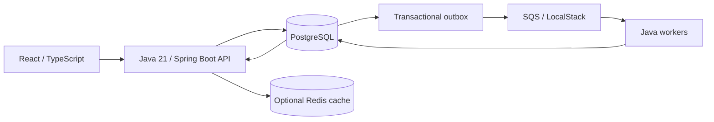

# PokerLab Cloud

A distributed Texas Hold’em simulation platform: submit exact hands, split millions of Monte Carlo trials into reproducible batches, process them with independent workers, and inspect equity and progress in a React workspace.

Built around an existing Java poker engine, with PostgreSQL as the durable source of truth and explicit protection against duplicate queue delivery.

## Architecture



## Features

- 2–9 players with exact hole cards, 0–5 known community cards and up to 100 million trials.
- Seeded batches, correct multiway tie splitting, per-player wins/ties/losses/equity.
- Durable submission/outbox, retry, visibility renewal, dead-letter handling and idempotent finalisation.
- PostgreSQL migrations and real concurrency tests; optional Redis cache with outage fallback.
- Scenario form, progress polling, results and recent simulations.
- OpenAPI, structured logs, Actuator metrics, Docker Compose, AWS Terraform and GitHub Actions.

The separate `solver` Maven module is an early GTO trainer foundation. It implements vanilla CFR and a scalar CFR+ variant, validates against Kuhn poker, and models a bounded preflop all-in subgame with weighted exact-card ranges. Its backend drill logic draws blocker-adjusted hands and grades action EV loss from a saved pack. An opt-in [research API](docs/local-development.md#research-trainer-api) can exercise a screened, exact-payoff **validation-only** pack locally. It is disabled by default and is not a published playable GTO trainer. See the [GTO trainer plan](docs/GTO_Trainer_Plan.md) for scope and validation steps.

Java 21 · Maven · Spring Boot 3.5 · PostgreSQL 16 · SQS · Redis 7 · React 19 · TypeScript · Vite · Terraform · ECS Fargate

## Quick start

Requires Docker with Linux containers and Compose v2. The stack includes application images and two workers; no separate Java/Node installation is needed.

```sh
git clone https://github.com/pingadom/PokerSolver.git
cd PokerSolver
git checkout codex/pokerlab-cloud
cp .env.example .env
docker compose up --build -d --scale worker=2
```

On PowerShell, replace the copy command with `Copy-Item .env.example .env`.

Open **[PokerLab at localhost:8080](http://localhost:8080)**. Submit the default AA vs KK vs QQ scenario. View [Swagger](http://localhost:18080/swagger-ui/index.html) or [health](http://localhost:18080/actuator/health).

Run `./scripts/smoke.ps1` on Windows, or `./scripts/smoke.sh` with curl/jq on Linux. Stop with `docker compose down`; the database volume is preserved. [Local development](docs/local-development.md) covers IDE runs and a durable PostgreSQL queue alternative when Docker is unavailable.

## API example

```sh
curl http://localhost:18080/api/v1/simulations \
  -H 'Content-Type: application/json' \
  -d '{"players":[{"name":"AA","cards":["AS","AH"]},{"name":"KK","cards":["KS","KH"]},{"name":"QQ","cards":["QS","QH"]}],"board":[],"iterations":10000000,"batchSize":100000,"seed":123456789}'
```

The API returns **202 Accepted**, a `Location` header and:

```json
{
  "simulationId": "<generated UUID>",
  "status": "QUEUED",
  "statusUrl": "/api/v1/simulations/<generated UUID>"
}
```

Poll the status URL for `completedIterations / requestedIterations`. Fetch `{statusUrl}/results` for per-player counts and equity: 200 when complete, 202 while processing, 409 after terminal failure. `GET /api/v1/simulations?limit=20&offset=0` returns recent runs. Errors consistently return `{"code":"...","message":"..."}`.

Seeds can be JSON integers or decimal strings on submission. Status responses use strings to preserve all 64 bits in browsers. Fractional trial/batch counts are rejected. The same scenario, seed, batch size and engine version reproduce counts; measured elapsed time naturally varies.

## Verification

```sh
mvn spotless:check verify
cd frontend
pnpm install --frozen-lockfile
pnpm lint
pnpm typecheck
pnpm test
pnpm build
```

Docker enables disposable PostgreSQL/Redis Testcontainers suites. A dedicated native PostgreSQL database can run the same lifecycle contract using `TEST_DATABASE_URL`; see the development guide. CI additionally builds all images and completes a two-worker LocalStack simulation with Redis both available and stopped.

The inherited evaluator is covered by category/tiebreaker tests and an exhaustive check over all 2,598,960 five-card hands. Distributed tests exercise duplicate submission, races, out-of-order completion, failure and retry. [Build progress](docs/build-progress.md) records acceptance evidence and limitations.

To regenerate the solver's validation-only pack, first install the engine and solver modules locally, then run the offline generator from `solver`:

```sh
mvn -pl solver -am -DskipTests install
cd solver
mvn -q exec:java '-Dexec.mainClass=com.pokerlab.solver.GenerateValidationPack' '-Dexec.args=exact target/validation-pack.json 3000 2026-09-23T12:00:00Z'
```

The output is not served to users. It uses exhaustive preflop runouts for eight unblocked combo matchups; the source spot and limits are documented in [ADR-004](docs/decisions/ADR-004-preflop-validation-game.md).
Use `exact-plus` in place of `exact` to generate a separate CFR+ validation pack. `mc-plus` likewise selects CFR+ with seeded Monte Carlo payoffs. Existing `exact` and `mc` commands retain the vanilla solver and reproduce the committed fixture.

For the wider synthetic research spot, use `exact-plus target/diverse-validation-pack.json 3000 2026-09-23T12:00:00Z diverse` as the generator arguments to reproduce the [committed exact fixture](solver/src/test/resources/diverse-validation-pack.json). Use `mc-plus target/diverse-sampled-pack.json 3000 10000 17 2026-09-23T12:00:00Z diverse` to compare a faster sampled payoff table. The command prints provisional content-screening findings. Exact payoffs pass the numeric screen, but the ranges remain synthetic and the pack is not served to users.

The [range-sensitivity study](docs/preflop-range-sensitivity.md) re-solves the exact fixture after ±25% one-combo weight changes and records which decisions move; it is part of the content review before any trainer API is enabled.

The [focused preflop trainer demo](docs/GTO_Demo_Scope_Review.md) now connects the wider exact two-player solution pack to a ten-decision website drill, with saved-pack identity checks, server-side EV grading and a complete session review. Run it locally with `docker compose -f docker-compose.yml -f docker-compose.trainer.yml up --build -d --scale worker=2`, then open `http://localhost:8080/#trainer`. The synthetic ranges and restricted all-in tree remain validation-only. The solver also has an experimental [six-seat all-in call game](docs/multiway-solver-research.md) with exact multiway payoffs and its own research API; general 6-max betting trees remain future work.

The [exact-payoff scaling study](docs/preflop-payoff-scaling.md) counts the cost of larger ranges and adds suit-equivalence reuse to the offline solver. It confirms that the current demo pack has no duplicate suit patterns to reuse, so larger lessons still need explicit range review and payoff benchmarking.

A separate [bounded river solver research path](docs/river-solver-research.md) now solves a fixed-board heads-up betting tree and serves opt-in, validation-only questions from a saved pack. With the local trainer overlay running, open `http://localhost:8080/#river` for its research drill. Its synthetic ranges are not a continuation of the preflop lesson or a general river strategy.

The [turn-to-river research model](docs/turn-river-solver-research.md) adds an exact public river-card chance node between two bounded betting rounds. A saved, validation-only pack powers an opt-in API and local `#turn-river` drill. Its synthetic fixture has a measured information-set best-response gap; it is not a reviewed full-hand lesson.

## Measured performance

Ten million trials, median of three runs, Ryzen 7 5700X3D / Java 21:

| Engine worker threads | Wall time | Trials/second | Speedup |
| --------------------- | --------: | ------------: | ------: |
| 1                     |  14.751 s |       677,904 |   1.00× |
| 2                     |   7.724 s |     1,294,622 |   1.91× |
| 4                     |   3.857 s |     2,592,441 |   3.82× |
| 8                     |   2.253 s |     4,437,734 |   6.55× |

These are engine thread measurements, not AWS or end-to-end queue scaling claims. [Method, raw data and reproduction](docs/benchmarks.md).

## Engineering notes

- [Architecture and failure modes](docs/architecture.md)
- [Queue decision](docs/decisions/ADR-001-queue.md)
- [PostgreSQL vs Redis](docs/decisions/ADR-002-postgres-vs-redis.md)
- [Idempotent workers and transaction boundaries](docs/decisions/ADR-003-idempotent-workers.md)
- [First preflop solver validation game](docs/decisions/ADR-004-preflop-validation-game.md)
- [AWS deployment, costs and teardown](docs/aws-deployment.md)
- [Observability and operations](docs/observability.md)
- [AI-assisted development record](docs/ai-development.md)

Terraform provisions a restricted demonstration environment and uses Secrets Manager without putting passwords in variables/state. Applying it is billable and manual. No infrastructure has been deployed as part of the build.

The release supports exact hands. Authentication, player ranges, cancellation, live push updates, automatic scaling and S3 exports are not implemented. Keep the unauthenticated API on loopback or behind the documented restricted ingress.

The original CLI remains available with `mvn -pl engine exec:java`.
