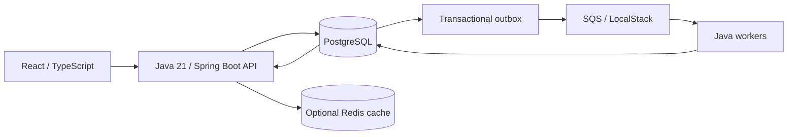

# PokerLab Cloud

A distributed Texas Hold’em simulation platform: submit exact hands, split millions of Monte Carlo trials into reproducible batches, process them with independent workers, and inspect equity and progress in a React workspace.

Built around an existing Java poker engine, with PostgreSQL as the durable source of truth and explicit protection against duplicate queue delivery.

## Architecture


```mermaid
flowchart LR
  UI[React / TypeScript] --> API[Java 21 / Spring Boot API]
  API --> PG[(PostgreSQL)]
  PG --> Outbox[Transactional outbox]
  Outbox --> SQS[SQS / LocalStack]
  SQS --> Workers[Java workers]
  Workers --> PG
  API --> Redis[(Optional Redis cache)]
  PG --> API
```

## Features

- 2–9 players with exact hole cards, 0–5 known community cards and up to 100 million trials.
- Seeded batches, correct multiway tie splitting, per-player wins/ties/losses/equity.
- Durable submission/outbox, retry, visibility renewal, dead-letter handling and idempotent finalisation.
- PostgreSQL migrations and real concurrency tests; optional Redis cache with outage fallback.
- Scenario form, progress polling, results and recent simulations.
- OpenAPI, structured logs, Actuator metrics, Docker Compose, AWS Terraform and GitHub Actions.

The separate `solver` Maven module implements PokerLab's own CFR/CFR+ solvers, exact finite-game best responses, weighted physical-card ranges and saved-pack EV grading. Local **validation-only** drills include an all-in demo, bounded street decisions and a full-round six-seat preflop table. The backend also connects every seat's preflop decisions to selected heads-up flop/turn/river betting continuations; [physical-flop width studies](docs/sixmax-flop-width-study.md) measure coverage and cost, while [continuation feedback](docs/sixmax-continuation-preflop-feedback.md) re-solves preflop against improved postflop values and checks the changed ranges. [Quality-gated alternating rounds](docs/sixmax-alternating-continuation-rounds.md) retain only candidates that meet conditional accuracy and materially improve the full-game score, with resumable source-bound policy checkpoints. [Eight-deal private coverage](docs/sixmax-eight-deal-private-coverage.md) adds folded-seat uncertainty and separate prior/reached range diagnostics. [Active-pair selection](docs/sixmax-diverse-active-pair-selection.md) can require material source hand mixes and choose different players while preserving full private support. [Correlated private ranges](docs/sixmax-correlated-private-ranges.md) retain twelve physical worlds across four uncertain seats, with offline pairwise and full-joint dependence audits that keep concealed ranges outside trainer questions. A [retained coverage screen and bounded menu search](docs/sixmax-retained-continuation-coverage.md) separate final-policy content usefulness from strategy quality; the earlier twelve-world trials improve their scores but fail retained reach and hand-diversity criteria. A [fresh betting-model study](docs/sixmax-preflop-payoff-reuse.md) reuses exact showdown shares while recomputing all betting utilities and strategies; both fresh open-only connected trials retain a useful BB/CO history and pass the same quality/content checks. A [same-game policy comparison](docs/sixmax-connected-policy-stability.md) measures independent-seed action-frequency disagreement without diluting rare postflop decisions. [History-dependent raises and range sensitivity](docs/sixmax-staged-raise-schedules.md) add explicit 3bb-open/9bb-re-raise rules, backwards-compatible versioned packs and matched-budget diagnostics; three fresh sources still fail the unchanged useful-content screen. An [all-flop material feasibility bound](docs/sixmax-material-continuation-feasibility.md) now rules out inadequate frozen-source hand coverage before more seed searches or connected solves; the open-only control remains not ruled out. The opt-in [research API](docs/local-development.md#research-trainer-api) is disabled by default. These synthetic, restricted games are not general cash-poker charts; see the [GTO trainer plan](docs/GTO_Trainer_Plan.md) for remaining scope and validation gates.

The [rank-aware six-seat continuation study](docs/sixmax-rank-texture-continuation.md) jointly trains preflop and a bounded heads-up flop bet round across 1,182 public rank/texture signals. Exact conditional payoffs, complete saved policies and independent physical-board audits measure both own-model quality and remaining suit information error. [Fixed-utility pruning](docs/sixmax-pruning-and-board-witnesses.md) reduces redundant folded-player traversal. These offline experiments remain validation-only and do not qualify as general poker lessons.

The [reached-decision audit](docs/sixmax-rank-texture-conditional-audit.md) checks every selected history/signal case and verifies local unilateral gains through direct full-game policy evaluation. Saved replay and independent pure-plan enumeration expose rare-decision gaps that the aggregate solver score can conceal.

The [bounded suit-refinement model](docs/sixmax-suit-refinement.md) now reveals actual flop cards in fifteen declared groups, trains fresh complete policies and replays 7,806 conditional cases. Every refined pair payoff is independently enumerated, while physical-board witnesses confirm that the declared groups preserve actual suits and folded blockers. Large rare-decision gaps remain, so these policies stay offline validation evidence.

[Targeted conditional refinement](docs/sixmax-suit-conditional-refinement.md) now freezes preflop ranges and re-solves weak spots with explicit fresh budgets. A balanced 64-case derivative reduces the worst local gap from 6.60 to 1.28bb and improves the full-game gap by about 5.7%, while replay checks all 7,806 cases, unchanged strategy rows and predecessor lineage. It remains validation evidence; wider physical-board coverage and a retained trainer quality screen are still required.

[Physical-hand decision stability](docs/sixmax-suit-decision-stability.md) now calculates own-card action EVs with optimal hero continuation, checks fresh 500/1000-budget references and detects changes in the private-hand posterior after public actions. The first screen retains 23 of 32 physical board/history cases; 127 of 148 material decisions pass. Saved evidence replays every solve and EV, but limited physical coverage still prevents trainer admission.

[History-specific physical flop observations](docs/sixmax-history-physical-observations.md) expand the backend's fixed board menu within the existing compute caps. Public-history/card whitelists split exact physical payoffs from rank aggregates, preserve folded blockers and bind a separate model identity. The first menu reveals 530 flops in 915,457 states; fresh policies, complete parent/conditional reports and independent board/EV controls separate increased reached coverage from trainer-quality decisions. Selection currently concentrates on BB versus a CO open, and all evidence remains validation-only.

[History-specific conditional refinement and decision stability](docs/sixmax-history-physical-refinement.md) now freeze that model's preflop policy, re-solve selected physical posteriors and preserve every other strategy row. The broader 64-case candidate correctly fails its local gate and exports no policy. A separately declared accurate-case derivative passes complete parent checks, and fresh 500/1,000-budget references retain 28 of 32 screened cases with 143 of 151 material decisions passing. That bounded sample covers only 0.132% of all heads-up reach; it remains research evidence with trainer admission disabled.

[The owned bounded maxmin solver](docs/sixmax-owned-maxmin.md) now preserves that accepted CFR derivative and repairs its twenty remaining weak physical-board games. All 530 reached physical roots meet the local gate, full-parent NashConv improves to 0.00136881bb, and independent decision screening preserves the 28-case retained sample. Complete matrix/behavioral-policy replay and 120 independent mathematical controls validate the solver; it adds no production LP dependency or trainer admission.

The literal-board model also has a proved capacity limit: its 600 history/board revelations can cover at most 6.073% of heads-up flops before quality filtering. Coverage requests above that limit fail before input loading or enumeration. The [compact 530-board storage prototype](docs/sixmax-compact-physical-storage.md) now exactly restores all counts/payouts and reproduces full parent/conditional diagnostics and twenty local maxmin/CFR+ controls with primitive lookup arrays. The [broader physical-capacity design](docs/sixmax-broader-physical-capacity-design.md) keeps the unchanged 25% retained-content target and requires a separately identified broader model with measured state, memory and evidence budgets. Compact storage leaves legal states and coverage unchanged.

Java 21 · Maven · Spring Boot 4.1 · PostgreSQL 16 · SQS · Redis 7 · React 19 · TypeScript · Vite · Terraform · ECS Fargate

## Quick start

Requires Docker with Linux containers and Compose v2. The stack includes application images and two workers; no separate Java/Node installation is needed.

```sh
git clone https://github.com/pingadom/PokerSolver.git
cd PokerSolver
cp .env.example .env
docker compose up --build -d --scale worker=2
```

On PowerShell, replace the copy command with `Copy-Item .env.example .env`.

Open **[PokerLab at localhost:8080](http://localhost:8080)**. Submit the default AA vs KK vs QQ scenario. View [Swagger](http://localhost:18080/swagger-ui/index.html) or [health](http://localhost:18080/actuator/health).

Run `./scripts/smoke.ps1` on Windows, or `./scripts/smoke.sh` with curl/jq on Linux. Stop with `docker compose down`; the database volume is preserved. [Local development](docs/local-development.md) covers IDE runs and a durable PostgreSQL queue alternative when Docker is unavailable.

## API example

```sh
curl http://localhost:18080/api/v1/simulations \
  -H 'Content-Type: application/json' \
  -d '{"players":[{"name":"AA","cards":["AS","AH"]},{"name":"KK","cards":["KS","KH"]},{"name":"QQ","cards":["QS","QH"]}],"board":[],"iterations":10000000,"batchSize":100000,"seed":123456789}'
```

The API returns **202 Accepted**, a `Location` header and:

```json
{
  "simulationId": "<generated UUID>",
  "status": "QUEUED",
  "statusUrl": "/api/v1/simulations/<generated UUID>"
}
```

Poll the status URL for `completedIterations / requestedIterations`. Fetch `{statusUrl}/results` for per-player counts and equity: 200 when complete, 202 while processing, 409 after terminal failure. `GET /api/v1/simulations?limit=20&offset=0` returns recent runs. Errors consistently return `{"code":"...","message":"..."}`.

Seeds can be JSON integers or decimal strings on submission. Status responses use strings to preserve all 64 bits in browsers. Fractional trial/batch counts are rejected. The same scenario, seed, batch size and engine version reproduce counts; measured elapsed time naturally varies.

## Verification

```sh
mvn spotless:check verify
cd frontend
pnpm install --frozen-lockfile
pnpm lint
pnpm typecheck
pnpm test
pnpm build
```

Docker enables disposable PostgreSQL/Redis Testcontainers suites. A dedicated native PostgreSQL database can run the same lifecycle contract using `TEST_DATABASE_URL`; see the development guide. CI additionally builds all images and completes a two-worker LocalStack simulation with Redis both available and stopped.

The inherited evaluator is covered by category/tiebreaker tests and an exhaustive check over all 2,598,960 five-card hands. Distributed tests exercise duplicate submission, races, out-of-order completion, failure and retry. [Build progress](docs/build-progress.md) records acceptance evidence and limitations.

To regenerate the solver's validation-only pack, first install the engine and solver modules locally, then run the offline generator from `solver`:

```sh
mvn -pl solver -am -DskipTests install
cd solver
mvn -q exec:java '-Dexec.mainClass=com.pokerlab.solver.GenerateValidationPack' '-Dexec.args=exact target/validation-pack.json 3000 2026-09-23T12:00:00Z'
```

The output is not served to users. It uses exhaustive preflop runouts for eight unblocked combo matchups; the source spot and limits are documented in [ADR-004](docs/decisions/ADR-004-preflop-validation-game.md).
Use `exact-plus` in place of `exact` to generate a separate CFR+ validation pack. `mc-plus` likewise selects CFR+ with seeded Monte Carlo payoffs. Existing `exact` and `mc` commands retain the vanilla solver and reproduce the committed fixture.

For the wider synthetic research spot, use `exact-plus target/diverse-validation-pack.json 3000 2026-09-23T12:00:00Z diverse` as the generator arguments to reproduce the [committed exact fixture](solver/src/test/resources/diverse-validation-pack.json). Use `mc-plus target/diverse-sampled-pack.json 3000 10000 17 2026-09-23T12:00:00Z diverse` to compare a faster sampled payoff table. The command prints provisional content-screening findings. Exact payoffs pass the numeric screen, but the ranges remain synthetic and the pack is not served to users.

The [range-sensitivity study](docs/preflop-range-sensitivity.md) re-solves the exact fixture after ±25% one-combo weight changes and records which decisions move; it is part of the content review before any trainer API is enabled.

The [focused preflop trainer demo](docs/GTO_Demo_Scope_Review.md) now connects the wider exact two-player solution pack to a ten-decision website drill, with saved-pack identity checks, server-side EV grading and a complete session review. Run it locally with `docker compose -f docker-compose.yml -f docker-compose.trainer.yml up --build -d --scale worker=2`, then open `http://localhost:8080/#trainer`. The synthetic ranges and restricted all-in tree remain validation-only. The solver also has an experimental [six-seat all-in call game](docs/multiway-solver-research.md) with exact multiway payoffs, opt-in research API and local `#multiway` drill; general 6-max betting trees remain future work.

The [exact-payoff scaling study](docs/preflop-payoff-scaling.md) counts the cost of larger ranges and adds suit-equivalence reuse to the offline solver. It confirms that the current demo pack has no duplicate suit patterns to reuse, so larger lessons still need explicit range review and payoff benchmarking.

The [bounded six-seat preflop betting rules](docs/preflop-betting-tree-research.md) validate full action order, minimum raises and chip commitments. A [saved full-round pack](docs/sixmax-full-round-pack-trainer.md) powers the local `#sixmax-preflop` trainer with exact grading. The [sparse connected solver](docs/sixmax-connected-preflop.md) adds selected physical heads-up betting continuations; other non-all-in branches use explicitly declared mandatory checkdown. Broader ranges, board coverage, multiway postflop, raises and rake remain research gates.

A separate [bounded river solver research path](docs/river-solver-research.md) now solves a fixed-board heads-up betting tree and serves opt-in, validation-only questions from a saved pack. With the local trainer overlay running, open `http://localhost:8080/#river` for its research drill. Its synthetic ranges are not a continuation of the preflop lesson or a general river strategy.

The [turn-to-river research model](docs/turn-river-solver-research.md) adds an exact public river-card chance node between two bounded betting rounds. A saved, validation-only pack powers an opt-in API, `#turn-river` decision drill and `#turn-river-hand` connected partial-hand replay. Its synthetic fixture has a measured information-set best-response gap; it is not a reviewed full-hand lesson.

The [flop-to-river solver research model](docs/flop-turn-river-solver-research.md) connects all three postflop streets. Its five-card turn abstraction has measurable payoff bias; the full-deck game now has a compressed validation-only solution pack with a 0.007446bb best-response gap. The local trainer overlay enables a connected partial-hand drill at `#flop-hand`. It is still synthetic research, not a reviewed 6-max lesson or general preflop continuation value.

The [joint preflop/flop-texture experiment](docs/sixmax-texture-continuation.md) replaces mandatory checkdown at declared heads-up histories with one betting round across all physical flop textures. It retains folded blockers, generates exact conditional equity tables offline, trains the complete six-player game, and audits saved checkpoints independently. The coarse public signal hides board ranks/cards, so its scores and coverage remain research evidence rather than full-poker GTO or trainer admission.

## Measured performance

Ten million trials, median of three runs, Ryzen 7 5700X3D / Java 21:

| Engine worker threads | Wall time | Trials/second | Speedup |
| --------------------- | --------: | ------------: | ------: |
| 1                     |  14.751 s |       677,904 |   1.00× |
| 2                     |   7.724 s |     1,294,622 |   1.91× |
| 4                     |   3.857 s |     2,592,441 |   3.82× |
| 8                     |   2.253 s |     4,437,734 |   6.55× |

These are engine thread measurements, not AWS or end-to-end queue scaling claims. [Method, raw data and reproduction](docs/benchmarks.md).

## Engineering notes

- [Architecture and failure modes](docs/architecture.md)
- [Queue decision](docs/decisions/ADR-001-queue.md)
- [PostgreSQL vs Redis](docs/decisions/ADR-002-postgres-vs-redis.md)
- [Idempotent workers and transaction boundaries](docs/decisions/ADR-003-idempotent-workers.md)
- [First preflop solver validation game](docs/decisions/ADR-004-preflop-validation-game.md)
- [AWS deployment, costs and teardown](docs/aws-deployment.md)
- [Observability and operations](docs/observability.md)
- [AI-assisted development record](docs/ai-development.md)

Terraform provisions a restricted demonstration environment and uses Secrets Manager without putting passwords in variables/state. Applying it is billable and manual. No infrastructure has been deployed as part of the build.

The release supports exact hands. Authentication, player ranges, cancellation, live push updates, automatic scaling and S3 exports are not implemented. Keep the unauthenticated API on loopback or behind the documented restricted ingress.

The original CLI remains available with `mvn -pl engine exec:java`.
