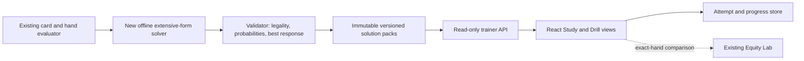

# PokerLab GTO Trainer — implementation plan

**Status:** implementation underway, 23 September 2026. Product direction confirmed: **6-max cash preflop first**, then turn, river, partial-hand and full-hand practice, with more game formats later. PokerLab will generate its own strategy data. Planning assumption: 100bb effective stacks and chip EV. Start solver validation without rake; realistic cash packs will specify rake, blinds and allowed bet sizes before solving.

## Current implementation

The independent `solver` Maven module now has alternating full-tree **vanilla CFR and CFR+ style regret matching**, a Kuhn poker benchmark, exact strategy-profile evaluation, and a conditional two-player preflop shove/fold then call/fold game. The CFR+ variant clips cumulative regrets after each player's full pass and uses linearly weighted strategy averaging with no delay; it is a scalar correctness implementation, not a vectorized large-game solver ([algorithm reference](https://arxiv.org/html/1407.5042v1)). The preflop model removes blocked card combinations, normalizes weighted range matchups, and accounts for committed chips and dead money. Called all-in payoffs can use either reproducible Monte Carlo estimates or exhaustive board enumeration. A [versioned, validation-only pack](../solver/src/test/resources/validation-pack.json) binds the six-seat spot hash, exact matchup payoffs, combo strategies, action EVs and a best-response gap; the loader checks these values again. The committed synthetic fixture has a 0.011635bb gap after 3,000 vanilla CFR iterations and zero payoff sampling error. On the same exact payoff table and iteration budget, CFR+ reaches about 0.0000078bb; this is a small-fixture result, not a broader speed claim. A backend `PreflopTrainer` can draw reproducible, blocker-adjusted hero hands, return a question without private opponent cards or action EVs, and grade a choice by exact-combo EV loss. It includes the no-rake model and quality numbers with each question. The fixture's three hero combos all shove at approximately 99.98% frequency, so it is useful for verifying the grading path but would be a poor lesson. This is a correctness foundation, **not a published training pack, trainer API or general 100bb opening chart**. Broader ranges with meaningful decisions, precision benchmarks, a publication threshold and the first playable drill remain ahead.

## Product boundary

PokerLab currently estimates **showdown equity for exact hole cards** by sampling unknown boards. That is useful for studying a matchup, but it cannot tell a player whether to check, bet, call, raise, or fold. A GTO trainer needs a specified game (ranges, board, pot, stacks, action order, legal bet sizes and payoff rules) plus an approximately equilibrium **strategy at each decision**. The existing equity simulator should remain available as an **Equity Lab**, linked from training feedback for context, without being used to grade decisions.

For the first release, “GTO” will mean an approximate strategy **within a displayed, bounded game and betting tree**. It will not mean an exact solution to unrestricted 6-max no-limit Hold'em. Every exercise must show its assumptions and solution quality. A no-rake, two-player zero-sum subgame can be checked with a best-response/Nash-gap measure; the corresponding CFR convergence claim does not automatically extend to raked or multiway play. [CFR](https://papers.nips.cc/paper_files/paper/2007/hash/08d98638c6fcd194a4b1e6992063e944-Abstract.html) and [CFR+](https://arxiv.org/abs/1407.5042) are established approaches to approximating equilibrium in imperfect-information poker games; solution builders require ranges, pot/stack settings and a betting tree as inputs ([GTO Wizard documentation](https://help.gtowizard.com/how-to-build-custom-solutions/)).

## First target: 6-max cash preflop

The product target is 6-max cash preflop: unopened raises by position, blind defence, facing opens, 3-bets and 4-bets at a documented stack depth and rake structure. Start with a 100bb reference configuration unless the game definition changes during the first milestone. The eventual chart must respect all six seats, folded players, card removal, legal actions and downstream play. A 13×13 grid should show strategy by hand class, while grading uses the exact two-card combo and its blockers.

The **solver proof** can start with Kuhn/Leduc poker and a bounded, no-rake preflop all-in subgame. In a 6-max cash context, a late preflop shove/call spot that is all-in if called avoids unresolved postflop branches and gives a real, clearly labelled first training exercise. This is a correctness milestone, not a substitute for ordinary 100bb open/call/3-bet charts. The first broader user-facing curriculum should then expand through heads-up pots from a six-seat table (for example, button versus big blind after the other seats fold) before tackling branches where several players remain in the hand. Cash packs with rake need their own payoff and quality validation.

For deep-stack opens and calls, the solver must model **postflop continuation**. Showdown equity alone cannot value a preflop call or small raise that reaches later decisions. River, turn and flop models therefore become prerequisites for broad 100bb preflop charts, even though the **trainer's first priority and first navigational section remain preflop**. This makes the work a staged solver project measured in months rather than a quick frontend feature. Importing another trainer's proprietary solutions is outside this plan.

## Player experience

1. Choose a 6-max cash preflop lesson by position and action history, or start a short random drill. Examples grow from an all-in response spot to opening, blind defence and 3-bet decisions as their solution packs pass validation. Later, a **Mixed Practice** mode samples from validated preflop, turn, river, partial-hand and full-hand packs, with user-adjustable weights and filters. It should never offer a mode for which no solved packs exist.
2. See the game format, position, hero cards, blinds, pot, effective stack, previous actions and only the actions legal at this node. For later streets, show the board. The opponent's private cards remain hidden.
3. Pick an action. Reveal the solution's action frequencies for this exact combo, action EVs in big blinds, and the EV difference from the best available action. A mixed strategy is shown as a mix; a lower-frequency action is not automatically branded a mistake when its EV is effectively tied.
4. Show a concise reason tied to the actual spot (blockers, range interaction, pot odds) and let the user inspect both players' ranges and the relevant action tree. Explanatory text is editorial content reviewed against the solved data, not generated as if it were solver output.
5. Save the attempt, move to the next spot, and offer a review queue for decisions with high EV loss. Keep session totals and per-topic progress separate from the existing simulation history. The 13×13 grid can switch between strategy view and “hands I miss” view.

An optional “open in Equity Lab” action can populate the current simulator with **specific compatible hands** for comparison, but must explain that one exact-hand showdown equity is different from range-versus-range strategy EV. The trainer itself should not display a single “correct” button for mixed nodes. Established trainers expose strategy frequencies and session/EV-loss feedback, which are useful reference patterns rather than data sources ([training flow](https://help.gtowizard.com/how-to-use-the-trainer/), [performance metrics](https://help.gtowizard.com/measure-performance/)).

## Architecture and data contracts

- Add a `solver` Maven module, independent of Spring, with information sets, weighted two-card ranges, blocker-aware combo enumeration, legal action trees, terminal chip payoffs and CFR/CFR+ strategy generation. Reuse `engine` card parsing and `HandEvaluator`; do not repurpose the Monte Carlo batch result as strategy data. Prove the generic tree on Kuhn poker before connecting Hold'em.
- Define a versioned `SpotDefinition`: table size, active seats, street, board where present, positions, blinds/antes, pot and effective stacks in big blinds, starting range weights, action history, permitted actions/sizes, rake model, and a stable content hash. The initial validation pack is a 6-max cash *context* with a two-player preflop all-in decision, chip EV and explicitly **no rake**. Later cash packs must carry their actual rake rule; calls and multiway branches enter only when their continuation model is validated.
- For the first all-in branch, compute matchup payoffs with card removal. Benchmark exact enumeration on small validation sets and use a reproducible, measured method for larger payoff tables; track both solver convergence error and any payoff-estimation error in the pack. For non-all-in preflop actions, use a validated postflop continuation strategy, not terminal showdown equity. Never present a solution-quality number that ignores sampling or continuation-model uncertainty.
- Define a `SolutionPack`: spot hash, solver/build version, generation date, convergence metric and unit, legal actions, combo-level action probabilities, combo/action EVs, and range summaries. Reject packs with unknown versions, illegal combos, missing actions or probabilities that do not sum to one within a documented tolerance.
- Generate packs **offline**. Serve reviewed packs through read-only endpoints such as `GET /api/v1/trainer/spots`, `GET /api/v1/trainer/spots/{id}` and `GET /api/v1/trainer/spots/{id}/strategy?combo=...`. Store small immutable compressed packs as application artifacts first; add object storage only when pack size and deployment needs justify it.
- Save `Attempt` data (`spotId`, solution version, node, hero combo, selected action, best/action EV, EV loss, time) separately from Monte Carlo `Simulation` data. Anonymous local progress is enough for the first vertical slice; per-user PostgreSQL progress requires authentication and privacy design later.
- Keep the existing `/api/v1/simulations` and worker path intact. Preflop payoff generation and later turn/flop solving may become compute-heavy; add a **separate solve-job type and resource budget** before reusing the queue/outbox infrastructure. A page request must never launch an unconstrained solve.
- Define a `TrainingMode` registry (`PREFLOP`, `TURN`, `RIVER`, `PARTIAL_HAND`, `FULL_HAND`) whose entries point to compatible solution packs. A partial hand starts from a saved public/action state. Full-hand play requires a **coherent strategy across connected decision nodes**; independently solved spot packs cannot simply be stitched together and called a full-hand solution. The mixed-mode picker samples only published, compatible packs and records its selection seed for repeatable sessions.

## Delivery sequence and exit criteria

| Milestone | Work | Done when |
| --- | --- | --- |
| **0. Freeze the cash-game model** | Write the first 6-max 100bb ruleset: blinds, the no-rake validation baseline and future rake/cap variants, allowed open/3-bet/4-bet sizes, fold order, chip-EV accounting and a bounded initial decision. Record an ADR explaining solution labels and limits. | A reviewer can reconstruct every chip flow and legal action; the UI shows the exact ruleset for each drill. |
| **1. Prove the solver** | Implement vanilla CFR on Kuhn poker as a correctness harness, then a scalar CFR+ variant for a two-player, all-in preflop subgame from a six-seat cash table. Reuse the evaluator for runout payoffs and blockers. Extend benchmarks to broader ranges before declaring this milestone complete. | Known small-game equilibria, fold/call/jam payoffs, pot conservation, action legality and deterministic export pass automated tests. |
| **2. Validate and publish the first preflop pack** | Compute a two-player best-response/Nash-gap measure; benchmark payoff-table precision; add convergence curves and a pack validator. Publish the bounded all-in spot with conspicuous action/stack assumptions. | A drill can be graded from PokerLab-generated data, and every published pack reports model, solver and payoff uncertainty. The pack cannot be mistaken for a general RFI chart. |
| **3. Ship preflop Study and Drill** | Add a 13×13 chart, combo detail, table/position view, legal decision controls, mixed-frequency feedback, action EV/EV loss, session summary and Equity Lab link. | A user can complete a ten-decision preflop session on desktop and mobile, inspect each decision, and cannot submit an illegal action. |
| **4. Build postflop continuation** | Solve bounded heads-up river trees, then turn and flop chance nodes; benchmark action/card abstraction, rake handling and payoff error. Add these as turn/river and partial-hand drills. | Postflop packs pass their own validation; non-all-in preflop branches have a measured continuation model rather than raw showdown equity. |
| **5. Broaden 6-max preflop** | Expand from conditional heads-up pots to unopened opens by position, blind defence, facing opens and 3-/4-bet branches. Add realistic rake/cap and multiway continuations only with separate solver and payoff validation; do not apply a no-rake two-player convergence claim to these games. | A curated set of common 100bb preflop decisions is available with its game/rake/bet-tree assumptions and measured quality; unsupported spots are absent. |
| **6. Learning loop and mixed modes** | Add topic filters, spaced review, progress, accessibility/keyboard polish, then a weighted random mixer for preflop, turn, river and partial hands. Connect coherent policy trees for full-hand play only when available. | Progress survives refresh; mixed sessions draw only from validated packs; a full-hand path never jumps between incompatible solutions. |

The first end-to-end vertical slice is **one documented 6-max cash preflop all-in subgame, one hero decision, one validated solution pack, and one feedback screen**. Build that before a large library, dashboards or deployment work. A working proof and first narrow drill may take **4–8 focused weeks**; a credible breadth of 100bb 6-max opening/defence strategy with an original multi-street solver is a **multi-month research and engineering phase**, not a promise attached to the first UI milestone. Re-estimate after the solver and payoff benchmarks.

Once the 6-max cash curriculum is credible, extend the same versioned game/pack contract to other stack depths, rake structures and table formats. Tournament chip-EV and ICM are separate payoff models; a cash-game strategy pack must never be reused under a tournament label. Add each format to the random trainer only after its own solver and content checks pass.

## Correctness and product checks

- **Solver:** Kuhn benchmark; all-in payoffs checked against the existing evaluator and selected exact board enumerations; impossible-card and range-weight validation; legal actions at every node; zero-sum/payoff conservation; deterministic solution export for fixed inputs; strategy probabilities sum to one; best-response gap trends down with training iterations.
- **Feedback:** action EV is measured at the displayed information set against the saved solution continuation, not estimated from one dealt outcome. EV loss is reported in big blinds with the solution version; near-equal mixed actions are treated as near-equal EV. Recompute scores from immutable solution data rather than trusting browser-submitted EV values.
- **UI/API:** same spot/version is used for the question and answer; no opponent private cards before reveal; responsive layout; keyboard controls; empty/error states; no stale feedback after switching spots; existing equity simulation still works.
- **Operations:** generation time, memory, pack size and solver convergence are benchmarked locally. Early no-rake two-player solutions get a measured best-response gap; raked and multiway solutions need separately defined validation and conservative labelling. Public AWS deployment remains paused; review expected compute/storage costs and access controls before any new cloud resources are proposed.

## Assumptions to confirm during milestone 0

1. Use **100bb 6-max cash, chip EV** as the reference format. The first solver benchmark uses no rake; define a realistic rake/cap model, open/raise sizes and whether limps are in scope before publishing broader cash solutions. Different stakes or rake rules require different packs.
2. Keep saved progress anonymous in this browser for the first vertical slice. Decide whether accounts and cross-device history belong in the next product phase after the training loop works locally.
