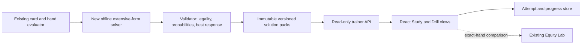

# PokerLab GTO Trainer — implementation plan

**Status:** implementation underway, 9 October 2026. Product direction confirmed: **6-max cash preflop first**, then turn, river, partial-hand and full-hand practice, with more game formats later. PokerLab will generate its own strategy data. Planning assumption: 100bb effective stacks and chip EV. Start solver validation without rake; realistic cash packs will specify rake, blinds and allowed bet sizes before solving.

The [supplied joint-range backend](sixmax-supplied-joint-preflop.md) adds a separate explicit-prior model to expand hand/seat support within measured exact-payoff budgets. Two new 18-world drills cover BTN/BB defense and CO facing a BTN 3-bet, each with three button hands; all ten material decisions pass both existing reference budgets. Complete board-count replay, independent literal pure-plan/EV checks and a ten-question offline trainer preserve research-only provenance; no source-policy reach, six-player equilibrium or public trainer admission is claimed. Next broaden useful scenarios, then design content registration that retains these provenance and quality boundaries.

The [explicit behavioral-floor backend](sixmax-behavior-floor-solver.md) now gives richer preflop action menus a separately identified owned affine LP solve, complete positive-realization certificates, independent constrained and original-game best responses, fresh floor-aware CFR+ references and exact diagnostic replay. Independent original full-flow HiGHS controls agree on all five floors across two separately identified representations. A new nonnegative excess-mass projection certifies floors down to 0.000001 without changing shared LP tolerances, with original-game gap about 0.00000410bb. The five-target menu at epsilon 0.0001 passes primary original-game quality but still fails reference quality and alternative-action EV stability; zero of five material rows passes every gate. No new trainer admission follows. Next investigate stable continuation selection and bounded numerical conditioning, preserving the complete existing feedback gates and broader coverage goals.

The [actual-card conditional preflop milestone](sixmax-actual-preflop-conditional-study.md) now carries the owned solver through full-joint action-conditioned beliefs, separate menu identities, complete independent action-EV screening, exact replay and a deterministic offline six-seat drill. Two small CO/BB raise ladders pass; a third offline limp–re-raise history passes all four material decisions and preserves folded callers' chips in the public table. The larger five-target ladder remains rejected despite a tiny primary solver gap. This supplies usable bounded backend practice without claiming broader cash ranges, strategic postflop continuation, six-player equilibrium or new physical-board retained coverage.

The [affine sequence-form milestone](sixmax-affine-sequence-form.md) now eliminates dependent own-action masses using exact integer projections, then certifies both owned LPs and the complete original game. It preserves the full-flow solver and saved replay. Fifty-four synthetic one-bet controls reach 32 private types within the unchanged 129-sequence/work limits; fifteen fixed-raise controls match an independent original full-flow oracle. The new separately bound physical derivative repairs the same twenty cases with 273,760 charged LP units plus 27,200 reduction units, preserving all parent/conditional checks and the 28-case retained decision screen. This is bounded two-player solver capacity, not new realistic poker content or admission. The next product-critical gaps remain broader retained coverage, realistic ranges/rake and multiway strategy quality.

The immediate, user-confirmed scope is the [focused solver demo](GTO_Demo_Scope_Review.md): one explainable preflop all-in spot with two active players at a six-seat table and a playable ten-decision trainer. The broader milestones below are a roadmap, not work required to finish that demo.

That demo is now implemented for local use with the wider exact validation pack. Its two-player API binds questions to the full saved pack, serves ten reproducible decisions and recomputes every EV and review total. The website shows the table history, assumptions, answer frequencies and a complete session review. [Local setup](local-development.md#research-trainer-api) and the [content review](preflop-demo-content-review.md) explain why the exercise remains `VALIDATION_ONLY`.

The next backend scaling check is documented in the [exact-payoff cost study](preflop-payoff-scaling.md). Suit-equivalence reuse preserves exact payoff values and can reduce duplicate board enumeration in suit-expanded ranges, but it saves no work on the current 47-matchup demo pack. Broader content therefore still needs credible input ranges and a measured payoff-computation budget before another lesson is published.

The [bounded river research model](river-solver-research.md) now covers a fixed board, one bet size, both players' check/bet and call/fold decisions, an exact-game best-response check, a versioned validation pack, an opt-in question/grade API and a local research drill. The [turn-to-river research model](turn-river-solver-research.md) adds a real public-card chance node and exact seven-card showdown, with a measured best-response gap, versioned validation pack, opt-in turn/river drill and connected partial-hand replay on a small two-street fixture. The [flop-to-river research model](flop-turn-river-solver-research.md) adds a third connected street and measures the cost and error of restricted versus exact turn chance. Its restricted fixture has a large check-down equity bias; a full-deck validation pack now powers an opt-in connected flop-hand drill. These are separate synthetic games. Their ranges have not been derived from a preceding street, so they cannot yet supply continuation values for broad preflop calls or appear as reviewed mixed-street lessons.

## Current implementation

The [owned sequence-form backend](sixmax-owned-sequence-form.md) now solves bounded perfect-recall two-player games through own-sequence conservation and two owned signed-RHS LPs, avoiding exponential pure-plan enumeration. Immutable snapshots, original primal/dual checks and independent behavioral best responses guard every solved handle. Its separate physical-board derivative preserves the accepted CFR lineage, repairs the same twenty cases, reassesses all parent/conditional support and retains 28/32 independently screened cases. A 32-private-type mathematical control uses 65 sequences per actor instead of 2^32 plans. This is solver capacity, not broader observation coverage, general six-player equilibrium or trainer admission. Next establish the separately identified broader-support model and measured budgets below.

The [owned bounded maxmin stage](sixmax-owned-maxmin.md) now preserves the accepted CFR derivative and repairs all twenty remaining weak physical-board cases with a separately bound simplex/behavioral-policy audit. Every reached physical root (530/530) meets the 0.001bb gate, parent NashConv is 0.00136881bb, and the independently screened sample still retains 28/32 cases and 143/151 material decisions. Four sampled cases remain action-EV unstable and 498 eligible cases are unexamined. No trainer admission follows. The [compact physical-storage compatibility prototype](sixmax-compact-physical-storage.md) is now implemented with exact restoration, complete diagnostic replay, twenty local maxmin/CFR+ controls and an isolated heap/byte benchmark. It leaves legal states and coverage unchanged. Next build a separately identified broader-support experiment with measured budgets and actual retained-coverage evidence, preserving the 25% target. Current caps and the AWS pause remain in force.

A [continuation-feedback stage](sixmax-continuation-preflop-feedback.md) now freezes exact postflop values for every original private deal and selected public history, re-solves all six seats preflop with exhaustive CFR+, preserves every postflop row and recomputes full-parent and conditional quality under the changed ranges. The offline pipeline adds a matched unrefined-continuation control and optional postflop refinement at those new ranges. Preflop-only and full-game deviation scores remain separate. Two 500/300/500/300 runs lower full-parent NashConv to 0.019167bb and 0.019238bb, but preflop feedback first breaks the conditional target (0.54–0.57bb); final postflop re-solving restores it to about 0.0112bb. The matched control has slightly lower parent scores while much worse conditional play, so no monotonic-improvement claim follows. A [quality-gated alternating workflow](sixmax-alternating-continuation-rounds.md) now repeats whole rounds, compares each candidate against the last retained policy, requires reached-branch conditional accuracy and material full-parent improvement, and stops without replacing the policy when a gate fails. Strict source/menu-bound average-policy checkpoints support resume with fresh quality audits. Both seeds pass two whole rounds, reaching full-parent NashConv of 0.019085bb and 0.019063bb with worst conditional gaps below 0.01146bb. A seed-711 checkpoint resume with 1,000 preflop / 300 postflop iterations further reaches 0.004971bb parent NashConv while retaining the conditional target; this single higher-budget case does not establish an advantage over a matched higher-budget control. These checks are finite-game evidence, not safe subgame-solving or multiplayer convergence guarantees. Broader private and physical-board support remains the next model gate; the results remain validation-only.

An [eight-deal private-support follow-up](sixmax-eight-deal-private-coverage.md) expands the connected model's cap from four to eight physical worlds without increasing the study's 16-pair / 2,000,000-state budget. A new exact source adds cutoff AKs/QTs uncertainty to the existing button suited-connector/pair and big-blind broadway/pair mix. Its two selected heads-up histories and one physical flop each retain all eight deals, producing 16 compatible pairs and 1,845,073 states. New source/retained-policy diagnostics separate original priors, counterfactual board support and action-conditioned beliefs, including uncertain folded-seat cards and own-hand information-set counts. Weighted-blocker and zero-reach tests preserve support and check hidden-card grouping across streets. This new source changes the game and selected-history ranking; its scores cannot be treated as convergence improvements over the preceding fixture. Both 500/300/500/300 seeds accept a whole round, lowering same-game parent NashConv from 0.017178/0.016978bb to 0.009733/0.009755bb with worst conditional gaps below 0.004707bb. The diagnostics also expose nearly deterministic cutoff AKs at the selected hands, despite a 50/50 original cutoff prior; eight supported worlds are not eight equally reached worlds. Different active-seat pairs and material source hand mass are addressed by the opt-in selector below; broader ranges, simultaneous board expansion and richer betting remain next.

The next connected coverage step now supports [distinct active-seat pairs with material source hand mass](sixmax-diverse-active-pair-selection.md). The opt-in selector preserves full counterfactual roots, reports skipped candidates, and refuses an incomplete or over-budget menu. Its eight-deal menu selects BB/BTN and CO/BTN rather than two histories with the same active players. Both 500/300/500/300 trials accept a complete round, lowering same-game parent NashConv from 0.027214/0.032554bb to 0.008658/0.008593bb with worst conditional gaps below 0.006bb. The retained CO/BTN ranges remain meaningfully mixed. This remains offline validation work, separate from broader ranges, richer betting and trainer admission.

A [correlated private-range expansion](sixmax-correlated-private-ranges.md) now permits twelve connected private worlds while preserving the sixteen-pair/two-million-state study budget. Four seats have uncertain hands, and HJ/CO share a possible ace: physical card removal changes their marginals and makes their joint prior dependent. Offline pairwise and full-joint audits expose absent hand combinations, mutual information, higher-order dependence and the distance from an independent approximation. The full-joint calculation visits supported worlds without expanding the marginal Cartesian product. This is a validation fixture, not a broad starting-hand range or trainer publication. Two 500-iteration CFR+ whole rounds were rejected for parent regression. Higher-budget 1,000-iteration linear-vanilla resumes accept both whole rounds, reducing same-game parent NashConv to 0.002573/0.002626bb with worst conditional gaps below 0.020074bb. Algorithm and budget both changed, so this is not a causal comparison. Final selected physical-flop reach is only about 3.76e-9 and BTN mixes become nearly deterministic. The retained-content screen below now measures that limitation separately from strategy quality. A local CPU profile identified repeated state validation and map lookup. Replacing three linear history searches with an immutable set preserves every state guard and yields about 13–14% less solve time in a separate small paired benchmark, with identical complete policies and exact scores. This is not a twelve-world or universal speed claim. Map lookup remains a measured throughput target before expanding ranges and betting.

A [retained continuation coverage screen](sixmax-retained-continuation-coverage.md) now checks final-policy history reach, selected heads-up coverage and material hand mixes for both active seats on every board. Provisional defaults are 0.0001 history probability, 25% heads-up history coverage and two combos of at least 5% each per active seat. The source passes; both quality-accepted twelve-world policies fail retained history reach and BTN hand diversity. Bounded deterministic menu search reproduces seed 715 for the source, but proves the declared history threshold infeasible under either retained policy before trying flops. New alternating v5 reports include both source and retained content decisions without changing the quality gate or promoting packs.

A [revised betting-model study with exact payoff reuse](sixmax-preflop-payoff-reuse.md) now solves fresh `[3,9]` and `[3]` games using all 684 exact showdown-share entries from the same twelve physical worlds. The builder validates the source, requires identical physical support and recomputes betting utilities, chance weights, policies and same-game quality; it never copies old strategy rows. Both models reach heads-up play much more often, but two-history menus still fail budget/content checks. A one-history `[3]` control passes the unchanged source content screen: BB versus CO reaches 33.79% of deals, covers 45.07% of heads-up mass and retains two material hands for each player at 12 compatible pairs / 1,323,133 states. The `[3,9]` one-history search still fails. `[3,9,100]` exceeds the unchanged public-tree cap. Both fresh connected seeds accept a whole round with parent NashConv below 0.00008bb and conditional gaps below 0.01217bb. Their final history reaches about 50% of deals, covers 66.63% of heads-up mass and still retains two material hands for both players. A source/menu-bound [independent-policy comparison](sixmax-connected-policy-stability.md) recomputes quality/content and measures action-frequency disagreement separately by preflop/postflop stage; paired frequencies are close at these fixed budgets, with the largest postflop row difference also reported. The open-only control deliberately omits 3-bets and shoves. The next backend gate is validation over more budgets and physical boards, followed by richer raise handling without losing meaningful hand support, before admitting a new trainer pack.

A [history-dependent raise schedule](sixmax-staged-raise-schedules.md) now permits a 3bb open followed by a 9bb re-raise, preserving limps, full six-seat action order, chip accounting and the existing tree caps. Versioned scheduled packs preserve historical global packs and hashes and prevent checkpoint transfer across models. A fresh twelve-world, 500-iteration source fits at 138,793 deal/public states, but its best selected mixed-hand history covers only 19.90% of heads-up mass and fails the unchanged 25% content requirement. Two controlled BTN suited-connector weight variations also fail. The new matched-budget range-weight audit separates blocker-conditioned chance changes from learned action changes: both probes move the physical prior by 1/6 TV, while doubling the connector weight changes reached action frequencies by 0.2053 weighted TV. More heads-up play and smaller different-game scores do not establish useful trainer content. The next model gate is reviewed range assumptions and material-history selection, alongside broader postflop incentives; successful connected models still need independent budget/physical-board checks before admission.

A [physical-flop width follow-up](sixmax-flop-width-study.md) now adds nested physical menus, exact tree-cost preflight, explicit larger study budgets and a plan-only CLI. The four-deal, two-history study grows from eight to twelve compatible deal/flop pairs and from 922,537 to 1,358,137 states; physical betting coverage rises by 58.89% under the frozen source policy. At 500 joint / 300 exact conditional iterations, both independent seeds meet the 0.05bb target, with maximum conditional gaps of 0.013494bb / 0.013270bb and small improvements in exact parent NashConv. A guarded inactive-seat shortcut also avoids traversing postflop for folded players' fixed-payoff best responses, checked against the full search. The continuation-feedback follow-up now feeds those values into preflop with separate parent and conditional audits; broader private ranges, multiway betting, postflop raises, full-board coverage and rake remain on the roadmap.

A [reached-continuation study](sixmax-reached-continuation-study.md) now adds suited, pair and broadway support with four exact physical deals and two unknown active-player ranges. It selects the two highest-reach source histories, trains the same connected six-seat game across seeds, and compares conditional budgets against a shared completed joint policy. Both seeds fail the 0.05bb conditional target at 100 iterations and pass at 300, with worst gaps of 0.013945bb/0.013839bb and small improvements in exact parent NashConv. The selected histories retain about 0.74–0.85% reach and cover 92–93% of learned heads-up mass, while only one physical flop per history is expanded. The physical-flop follow-up now measures wider coverage; the continuation-feedback follow-up now re-solves preflop against those values; broader ranges, multiway postflop, postflop raises and rake still precede realistic trainer publication.

A [paired traversal-cost experiment](sixmax-reached-continuation-study.md#traversal-cost-experiment) moves named-action validation to information-set creation while retaining consistency checks on every visit, with identical complete policies and exact best responses. This improves the measured two-player solve by about 7% on the new fixture. An additional immutable state/action cache has no measured benefit and stays off by default. These are local performance results, separate from solver quality.

A [conditional postflop refinement stage](sixmax-conditional-refinement.md) now freezes the sampled joint policy's preflop posterior, solves selected physical heads-up flop/turn/river games with exhaustive CFR+, maps supported rows back to actual seats, preserves all preflop and unsupported counterfactual rows, and rechecks exact six-player best responses. Across seeds 711 and 712, 100 conditional iterations lower maximum gaps from about 7bb to 0.014419bb with small improvements in parent NashConv. Complete policy input, source/coverage hashes, explicit zero-reach skips, separate stage budgets and repeatable exports keep provenance clear. This remains synthetic sparse research; the next gate is significant reached histories and wider private support before trainer publication.

A [chance-sampled six-seat coverage study](sixmax-flop-coverage.md) adds seeded unclipped CFR with physical or importance-weighted proposals, fixed checkdown control variates and explicit missing-policy audits. An optional schedule enumerates private deals and selected flops while sampling turn/river; optional linear weighting applies to both regrets and policy averages. On the four-flop, 500-iteration fixture this visits 192,961 of 210,961 rows with 25.75× fewer state visits than exhaustive traversal at that budget. Linear weighting lowers full-game NashConv to 0.004296bb, but the maximum conditional postflop gap remains 7.066358bb and betting-continuation reach becomes extremely small. This is a measured scalability milestone and an exposed quality failure, not a new trainer pack. The next priority is conditional strategy quality and support at histories reached by learned policies, followed by broader private/flop coverage.

A [sparse connected six-seat preflop experiment](sixmax-connected-preflop.md) now updates every preflop policy and selected heads-up flop, turn and river policies in one six-player CFR tree. It retains counterfactual private support, draws the six physical hands once, assigns each chosen flop its true 1/9,880 chance and integrates the remaining flops with residual mandatory-checkdown values. A same-budget baseline, exact six-player best responses, checkdown recovery and separately conditioned postflop quality measure the new model. This is an offline integration milestone, not broad flop coverage or a new realistic trainer pack. The next gate is a measured cost/accuracy path to wider flop and private-hand coverage.

The preceding [connected six-hand postflop solve and chance study](sixmax-connected-postflop.md) re-solves heads-up flop, turn and river decisions in one CFR tree derived from a frozen six-seat policy's correlated private posterior. Exact public chance retains folded cards and enumerates all 37 turns and 36 rivers, with stack-capped bets and all-in runouts. Its source-bound two-flop study contains 101,936 exact information sets and reaches a maximum 0.004192bb gap at 300 iterations. A four-quantile turn comparison reduces traversal by about 9.24 times and has a lower within-model gap at a larger budget, but up to 0.452797bb forced-checkdown bias. The sparse preflop follow-up above adds the missing preflop updates; broader flop coverage, more private hands and measured cost/accuracy choices still precede realistic lessons.

The [multiway solver research path](multiway-solver-research.md) now handles up to six players in a forced-shove, sequential call/fold subgame. It includes blocker-aware joint deals, exact board enumeration reused across active subsets, per-seat chip accounting, multi-player regret matching and unilateral deviation measurement. Immutable equal-stack and unequal-stack packs feed the separate opt-in API and local website drill with replayable ten-question sessions, mixed/fixed responding seats, conditional EV grading and complete session review. The unequal-stack variant settles main and side pots with exact-board payoffs, a measured deviation score and its own strictly validated, versioned pack. A larger exact side-pot fixture now covers 64 joint deals and two private combos per seat, yielding varied practice hands in the local research drill. The synthetic ranges and restricted game still make this a **validation-only model**, not a publishable six-player chart. No general open/raise tree or postflop continuation from this game is implemented yet; existing packs remain no-rake.

An [opt-in multiway rake sensitivity audit](multiway-solver-research.md#explicit-rake-in-the-offline-six-seat-game) now applies a declared fractional, capped, no-flop-no-drop charge to called main and side pots while returning uncalled chips. It reuses the committed exact showdown table to compare the saved no-rake policy with a fresh raked solve. A separate [versioned raked research artifact](multiway-solver-research.md#saved-raked-research-artifact) binds that exact source pack, the rule, strategy and recomputed metrics with a strict JSON loader. It remains `VALIDATION_ONLY` and is excluded from the trainer; no actual card-room schedule has been selected.

A [bounded six-seat preflop betting engine](preflop-betting-tree-research.md) now checks action order, commitments, minimum raises, fold wins and all-in endpoints for a configured raise-size menu. Its terminal-payoff bridge can settle a public fold without private cards or a called all-in from all six physical hole-card deals, with optional declared rake and per-seat utility. Exact-board payoffs match the independent forced-shove game on all 32 call/fold outcomes. The existing two-player spot still replays through these rules; a non-all-in call still ends at an explicit postflop-continuation boundary with no assigned EV. This is accounting validation, not a new six-max strategy chart.

The same engine now has a [last-action conditional EV evaluator](preflop-betting-tree-research.md#final-decision-conditional-ev). With a shown hero combo and explicitly action-conditioned ranges for all six seats, it compares a final fold with a called all-in by enumerating up to 64 unblocked joint deals and settling each call. It carries showdown sampling error separately from range assumptions and rejects unresolved postflop branches. This supplies a tested backend primitive for a wider preflop trainer, but it still needs credible action-conditioned range generation and a solved upstream betting policy before its answers can be labelled GTO.

A [forced-shove policy bridge](preflop-betting-tree-research.md#connecting-an-existing-solved-response-policy) now derives those conditional ranges from the existing six-player CFR solution for the specific UTG-shove, HJ-to-SB call/fold history and values BB's final choice under the same oracle and rake rule. Analytic controls and solved-profile trainer comparisons agree with the original game's conditional payoffs. This connects strategy likelihoods to the six-seat betting rules without making the source ranges, restricted action menu, or resulting drill a general six-max cash solution.

The bridge now also values [all five responding seats](preflop-betting-tree-research.md#connecting-an-existing-solved-response-policy): it conditions on each seat's shown hand and earlier public actions, holds that seat's fold or call fixed, and carries later solved policy actions through to six-seat terminal settlement. Seeded comparisons with the existing trainer agree at every responder seat under both no-rake and capped-rake assumptions. The next strategy milestone is a defensible six-seat opening/raising model with credible range provenance and measured postflop continuation, not more promotion of this forced-shove fixture.

A [bounded full-round preflop research game](preflop-betting-tree-research.md#complete-bounded-preflop-research-game) now exposes the six-seat betting rules directly to multi-player CFR. It covers a configurable raise menu from the initial blind posts, physical joint deals and explicit terminal settlement. Non-all-in pots follow a declared mandatory-checkdown rule, so the research game is mathematically complete but not a realistic postflop cash model. Tests cover a 3bb open and 100bb shove, exact board blockers, rake conservation, weighted chance and a small CFR+ solve. Its 64-deal, 20,000-public-state and 160,000 deal × public-state caps keep experiments bounded; it is not trainer-ready GTO content.

An [exact information-set best-response audit](preflop-betting-tree-research.md#exact-deviation-audit-inside-the-bounded-game) now measures unilateral gains for every seat in that finite game, including decisions where a player acts again after a raise. It cross-checks the older forced-shove response calculation and reports the chosen response actions alongside `NashConv`. This gives the new preflop solver a measurable internal quality gate; the checkdown closure, input ranges and any sampled payoff error still limit what the number says about real cash-game play.

The [convergence audit](sixmax-preflop-convergence-audit.md) and [expanded chance comparison](sixmax-expanded-chance-research.md) re-solve physical-card fixtures across CFR+ budgets. The latter runs 64 exact range-product deals, compares them with labelled empirical deal sampling, and exposes both chance-distribution discrepancy and showdown-payoff standard error. An [independent-board policy holdout](sixmax-preflop-payoff-holdout.md) now freezes the trained policy and evaluates its EV and six-seat best responses against separately sampled showdown tables on the same chance support. A mixed-pair fixture increases from 0.0228bb training NashConv to 0.0354–0.0382bb on two holdouts, while individual terminal payoffs still have up to about 6.6bb sampling SE. A backend [validation-only six-seat trainer](preflop-betting-tree-research.md#validation-only-full-seat-trainer-backend) can ask and conditionally grade reached preflop decisions, but these audited fixtures are not yet eligible for general GTO lessons. The next gates remain realistic position-specific ranges, lower payoff uncertainty, broader action menus, and connected postflop continuation.

A [saved full-round six-seat pack and trainer API](sixmax-full-round-pack-trainer.md) now persist the complete bounded preflop policy and all 57 active-subset showdown estimates per physical deal. Strict loading reconstructs the game, checks strategy/payoff coverage and recomputes its quality metrics. The committed 3bb/open-shove exact fixture has two deals, 7,089 information sets and 0.021103bb NashConv. Its opt-in API supplies hash-bound ten-decision sessions, conditional EV grading, per-action payoff uncertainty and replayed reviews; requests never solve or simulate boards. Only exact, numerically screened artifacts enter these sessions. The synthetic ranges and mandatory-checkdown model keep the artifact validation-only; the website now supplies a compact six-seat table, legal opens and raises, conditional feedback, full session reviews and replayable links. A standalone preview runs this saved policy without database or queue setup. The next solver gates remain credible range provenance, broader private-card/action support and validated postflop continuation.

A [heads-up preflop-to-flop research handoff](preflop-flop-transition-research.md) carries a completed two-player pot into the three-street game with correct postflop action order, pot, remaining stack and blocker-aware flop chance. That older two-range projection still uses explicit per-combo action likelihoods. A separate [policy-derived six-hand handoff](sixmax-policy-flop-handoff.md) now obtains the correlated posterior directly from the saved six-seat policy, retains folded-seat blockers, conditions physical flop chance and enumerates exact flop checkdown baselines. Its saved-policy audit finds 191 reached heads-up histories with 1.677833% total probability in the current tiny synthetic fixture.

A [conditional flop betting game and solve audit](sixmax-conditional-flop-betting.md) now consume that correlated six-hand chance input. Each heads-up game permits a single configured flop bet followed by mandatory turn/river checkdown, with exact physical-board payoffs, private information-set grouping, centered CFR utilities and restored six-seat chip values. A reproducible ten-flop export includes complete CFR+ strategies, exact conditional best-response bounds and action EVs; its worst conditional gap is about 0.000000707bb at 5,000 iterations, and first-player values differ from checkdown by up to about 0.89bb. Those figures describe only tiny conditional synthetic games; the audit does not change the playable preflop pack or admit new GTO lessons.

A [policy-derived turn/river betting continuation](sixmax-conditional-turn-river-betting.md) conditions the full six-hand distribution on public flop actions and a shown turn, then solves two connected betting rounds with exact physical river chance. It retains folded blockers, preserves public-history recall, carries actual six-seat commitments, returns uncalled bets and caps later bets by each branch's remaining stack. Conditional turn/river action EVs force the player's own earlier actions and condition on opponents and board cards. Five source-bound, reproducible 5,000-iteration solves contain 2,434 information sets and a maximum conditional best-response gap of about 0.000021754bb. Those conditional subgames freeze both upstream policies; the newer connected postflop tree described above also re-solves the flop. Preflop integration still needs measured chance coverage and wider ranges.

The [payoff sampling budget audit](sixmax-payoff-sampling-audit.md) can escalate board trials to a declared terminal-payoff SE target and explicitly fail at a cap. It now retains up to 64 deal streams rather than resampling earlier budgets. The mixed-pair fixture reaches a 2bb target at 32,000 boards per deal (maximum estimated terminal SE 1.635bb), with about 49.6% less board-evaluation work than replaying the budget ladder. At that board budget and 500 CFR+ iterations, training NashConv is 0.0250bb and two independent holdouts measure 0.0234–0.0266bb. This is an estimated-payoff gate and a finite-game diagnostic. Research-trainer feedback now carries conditional per-action payoff-SE envelopes, so a small action EV difference can be considered alongside its estimated sampling uncertainty.

A [connected BTN-versus-BB research game](connected-preflop-continuation-research.md) now learns a small preflop open/call strategy and flop/turn/river continuation in one CFR tree, with a measured best-response gap. Its fixed four-seat folds, synthetic ranges and restricted flop/turn deck mean it is still a solver correctness fixture, not a publishable 6-max preflop chart.

An [exact full-deck chance audit](connected-chance-abstraction-audit.md) now quantifies the separate abstraction error for forced check-downs. The initial connected fixture has over 1bb of weighted bias, and a seeded menu calibrated to its four combos fails badly on unseen combos. Broader preflop content must therefore pass independent range/board validation; a small gap against the abstract game alone is insufficient.

A [seeded chance-sampling study](chance-sampled-cfr-research.md) now compares vanilla CFR that samples every chance layer, a variant that enumerates private matchups before sampling public cards, and exhaustive CFR+ on the same connected game. Enumerating private matchups improves the sampled strategy gap substantially, but exhaustive CFR+ remains faster to a useful gap on this small fixture. This work provides reproducible scaling and audit infrastructure; sampled policies remain research-only and do not address the public-card bias above.

The [physical-deck connected path](physical-deck-connected-research.md) removes that handpicked-card bias by sampling all legal public runouts. A separate [board-bucket experiment](connected-board-bucket-research.md) shares coarse public observations and audits held-out self-play plus one-decision preflop deviations. At 5,000 iterations it visits about fourteen times fewer information sets and fixes a large pocket-aces opening error in the exact-observation profile, but it still has measurable deviations and no full-game quality bound. Neither connected profile is admitted to the trainer.

A [disjoint-range validation](connected-range-validation.md) adds nine new private matchups and sample-split audits of BB's first flop, turn and river decisions under learned earlier-street reach. Pocket aces still open frequently across two seeds, while a medium pair has an estimated preflop deviation and some selected later-street actions lose value on held-out states. Fewer than 10% of sampled river decisions sit in buckets with ten held-out observations, making later-street validation a concrete blocker for the broader preflop trainer.

A [board-granularity study](connected-bucket-granularity-research.md) compares the current and a much coarser observation on identical physical trajectories. The coarse mode raises the fraction of reached river decisions with 20 observations from roughly 1% to 54–58% across two seeds, but merges strategically distinct boards and has not passed a quality gate. It remains an offline research mode, not trainer content.

An exact-showdown [river alias audit](connected-bucket-granularity-research.md#river-information-loss-counterfactual) finds opposite fixed-response bet/check incentives inside both modes' information sets. The coarse grouping adds roughly 0.14bb of empirical observation loss in that controlled, always-called river bet test. This is a concrete reason to seek an observation with both sufficient sample support and better retention of strategic information before broadening the trainer.

The [observation-frontier follow-up](connected-abstraction-frontier.md) adds an intermediate texture mode, a 25-deal synthetic stress range, and sample-split river decisions. It measures the coverage/information tradeoff across all three modes on identical boards and shows that a coarser mode can win a low-data held-out *fixed-response* test despite worse perfect-information loss. Connected CFR sanity runs on both ranges still leave river validation sparse. No new connected-game pack is published.

The [range-aware river follow-up](range-aware-connected-river-research.md) uses exact showdown against the declared, blocker-adjusted opponent prior to add a river observation band. It improved held-out fixed-response decisions in the initial two seeds of two synthetic ranges and can be trained in the connected physical-deck game, but its prior is not conditioned on actions and a medium-pair preflop deviation remains. A paired held-out audit finds the 5×5 advantage under 50% independent calls is only about 0.005bb in those two seeds; a 16-seed sweep includes five splits favouring coarse. The larger gains against a pair-or-better caller still depend on that chosen response model. It is another offline research mode, not a trainer solution pack.

An [explicit action-belief follow-up](range-aware-connected-river-research.md#explicit-preflop-action-belief-experiment) multiplies opponent combo priors by externally declared BTN-open or BB-call likelihoods before assigning a river equity band. The held-out BB river audit samples the same synthetic action model: across eight 5×5 seeds, the conditioned observation gains about 0.067–0.078bb over the static observation, while two 3×3 seeds show no resolved gain. This verifies the Bayes update and gives an in-model benefit, but the likelihoods are chosen rather than learned, postflop checks are forced, and connected CFR actions need not follow the declared likelihoods. A [mis-specification sweep](range-aware-connected-river-research.md#belief-mis-specification-and-hand-dependent-response) shows that a reversed belief loses roughly 0.18–0.20bb against an always-calling BTN on 5×5. On 3×3 with a pair-or-better caller, even the correct preflop belief lowers selected gain by about 0.02–0.03bb; the equity band does not encode the BTN's river response. Informative postflop actions, response-aware observations and independent strategic validation are the next backend gates; this mode is not a trainer pack.

The [postflop-action follow-up](range-aware-connected-river-research.md#flop-and-turn-action-conditioned-reach) now samples both players' flop and turn checks under an explicit public-board/hand-strength likelihood model, so checkdown itself changes the reached opponent range. A separate river mode updates each candidate opponent combo from its own observed actions without exposing the dealt hidden hand. Across eight 5×5 seeds with an always-calling BTN, correct-model postflop conditioning gains about 0.093–0.113bb over preflop-only; reversing the check signal loses about 0.18–0.21bb. With a pair-or-better river caller, the correct-model gain is smaller and some intervals include zero. On the 3×3 pair-caller case, the static observation still beats both conditioned modes in the inspected seed. These are fixed synthetic likelihoods and responses, not a credible 6-max policy. The next gate is a response-aware observation plus independent strategic validation before any trainer promotion.

The [response-value follow-up](range-aware-connected-river-research.md#river-response-value-observation) tests a river bucket based on expected bet-minus-check value under an assumed BTN response. On 5×5, matched fixed-response models improve held-out selected gain by roughly 0.019–0.081bb over the postflop-equity bucket across four seeds. Assuming pair-or-better calls when BTN actually always calls loses roughly 0.175–0.269bb, a larger error than the matched gains. This remains an offline audit: the immediate solver priority is an independently justified strategic BTN response and connected-game validation, before using any response-aware policy for trainer questions.

The [one-step strategic caller follow-up](range-aware-connected-river-research.md#one-step-strategic-river-caller-and-support-backoff) makes BTN call/fold optimal against a declared BB river betting likelihood after public blockers and earlier observed actions. It gives the policy only public history, not a dealt BB hand. A finer response-value bucket alone *loses* about 0.017–0.036bb against this caller on four 5×5 seeds because support falls; falling back to the existing postflop bucket on unsupported states gains about 0.065–0.069bb instead. A wrong response model can still lose. The next solver milestone is to derive the river response from a connected solved policy and test independent physical-hand performance; no new trainer pack is warranted by this audit.

The [connected-policy response audit](range-aware-connected-river-research.md#connected-policy-river-response-transfer) now uses mixed BTN river call probabilities from independently trained connected CFR solutions, reports missing information sets and keeps support backoff. On synthetic, held-out 5×5 checkdown reach, an alternate-solution response gains only +0.010–0.039bb over the postflop bucket across four seeds, versus +0.147bb when seed 42 reuses the same solution as truth. This is an off-policy transfer, not a connected-game quality certificate. The next gate is to evaluate independent physical runouts reached by the learned preflop and postflop strategies themselves, with missing-policy mass and one-decision deviations made explicit.

The [on-policy connected river audit](range-aware-connected-river-research.md#on-policy-connected-river-response-and-one-decision-audit) now measures that gate on physical hands reached by the primary solution. It requires learned action strategies at each sampled decision, exactly evaluates the short river tree, and scores BB check/bet choices selected on separate discovery hands against held-out hands. With 3,000 iterations per solve, independent BTN call frequencies differ by about 0.079–0.093 on average across two seeds each of the 3×3 and 5×5 synthetic ranges. The alternate-informed minus primary-informed held-out BB gain ranges from −0.102 to +0.024bb, changing sign across seeds; river keys are also still occasionally missing. This is useful evidence about transfer instability, not a convergence certificate or trainer policy. Next prioritize independent-solve stability across training budgets and a connected-game deviation bound before promoting any response-aware observation.

The [training-budget sweep](range-aware-connected-river-research.md#independent-solve-training-budget-sweep) now runs 300, 1,000 and 3,000 iterations per independent solve on two seeds of each synthetic range. BTN response disagreement falls in all four seed/range pairs, but held-out BB action transfer remains inconsistent and sometimes worsens as the budget grows. This narrows the next backend task to broader seed coverage and **connected-game** deviation or best-response measurement; adding more training iterations alone is not an admission rule for a 6-max trainer pack.

A [strict connected street-deviation audit](connected-range-validation.md#strict-connected-policy-street-deviations) now rejects missing learned actions and scores BB check/bet choices on held-out physical hands at flop, turn and river. At 3,000 iterations, the 3×3 turn choice gains about 0.08–0.09bb over the learned mix in two seeds; at 10,000 iterations that resolved gain disappears. Wider-range and river results vary, and some discovery-selected actions lose value on held-out hands. This is encouraging as a diagnostic, but it is still one BB decision with fixed continuations, not a full-game quality bound. The next solver milestone needs a bounded full-game best-response or deviation test for both players before connected policies enter trainer packs.

An [exact finite-chance best-response bridge](connected-range-validation.md#exact-best-responses-on-sampled-physical-chance-subgames) now tests both players on small subgames cut from the physical deck, with explicit uniform completion and fallback-path accounting. The physical-game policy has large gaps on those aggressively restricted chance menus, while CFR+ trained on each same subgame reaches gaps around 0.001bb. The menu changes the game and can change what public boards reveal about private hands; these numbers are **not** full-deck exploitability. The next gate must quantify chance approximation error on broader held-out runouts or develop a full-deck sampled best-response estimator before the connected policy is eligible for trainer packs.

The [full-deck response search](full-deck-response-search.md) now trains a separate approximate response for BTN and BB against a fixed connected policy, then compares each with baseline on independent legal physical runouts. At a 50,000-iteration response budget, both 3×3 seeds show clear held-out BTN gains even against 10,000-iteration baselines (+0.089 and +0.096bb); 5×5 high-budget results are smaller and less consistently resolved. This is a meaningful **lower-bound deviation diagnostic** with explicit fallback and paired sampling error, not a certified best response or an exploitability upper bound. It keeps the connected physical policy out of trainer packs and focuses the next validation on response-search stability and a defensible full-game quality bound.

A [seed-and-budget stability audit](full-deck-response-search.md#seed-and-budget-stability-with-an-independent-confirmation-split) now trains four candidate responses per player, selects one on common validation hands, and scores it on a separate confirmation stream. Across two baseline seeds of each synthetic range, none of the eight selected player/profile confirmations resolves a positive deviation at 20,000 physical deals; some short-budget candidates lose value. This exposes response-training variance and validation-selection optimism rather than clearing the policy. A stronger full-game quality bound and realistic 6-max game model remain prerequisites for general trainer content.

An [exact finite-chance calibration and two-policy full-deck follow-up](full-deck-response-search.md#exact-game-calibration-of-response-optimization) identified why average-only search was weak: even with complete coverage in a small exactly enumerable physical subgame, averaged responses remained 0.001–0.056bb short of the exact response, while final-regret policies were consistently closer in the tested menu. The physical-deck audit now validates both variants before independent confirmation. Three of eight selected player/profile results have nominal positive intervals, including a +0.216bb BB deviation on 3×3 seed 42; other seeds remain unresolved. This strengthens the evidence of exploitable value in the synthetic connected policy and the need for better response-search bounds, without admitting a trainer pack.

An [exact-root chance variant](full-deck-response-search.md#enumerating-private-deals-while-sampling-public-cards) now enumerates all weighted private deals per response iteration while still sampling later legal public cards. At comparable initial-deal traversal budgets, it narrows exact-subgame response shortfall in some 5×5 cases and yields four nominally positive selected full-deck confirmations across eight player/profile runs. Results across seeds and the 3×3 comparison remain mixed, so it stays optional and does not alter the trainer-content gate.

A [three-menu, two-response-seed calibration](full-deck-response-search.md#response-optimizer-across-independent-chance-menus) now compares both sampling modes against exact best responses at roughly 50,000 private-deal traversals per search. Exact-root lowers mean and worst BB optimizer shortfall on both synthetic profiles, but it is neutral or slightly worse for BTN. The mode remains opt-in while more menus, seeds, and actual runtime are assessed; no restricted-menu result certifies full-deck equilibrium quality.

An [optional stratified full-deck evaluator](full-deck-response-search.md#stratified-held-out-full-deck-evaluation) visits every weighted private deal per independent held-out batch and computes uncertainty across batches. An exact-weight unit control passes. Eight-seed, equal-trajectory comparisons show less observed evaluation spread on the 5×5 fixture but more on 3×3, so sampled evaluation remains the default. This improves measurement infrastructure without supplying the missing full-deck best-response upper bound or changing trainer-pack eligibility.

An [action-integrated confirmation evaluator](full-deck-response-search.md#integrating-policy-actions-on-sampled-physical-runouts) now averages all policy action branches for each sampled legal public runout and measures fallback path probability. It lowers within-run paired error in four tested player/range cases but costs roughly 14–26 times more per private-deal traversal locally. The stability workflow can apply it on a separate seed to only the validation-selected candidate. This is stronger confirmation of a candidate deviation, not an exploitability upper bound or a trainer-pack quality pass.

A [missing-response support envelope](full-deck-response-search.md#bounding-the-effect-of-missing-response-keys) now bounds what **only filling absent response keys** could change, using their first-reach probability and a conservative terminal-payoff span. Full-budget, separate-seed action-integrated confirmation shows positive candidate deviations for both players on the 3×3 synthetic fixture, while the 5×5 results remain unresolved. The 5×5 BB candidate has estimated missing-response reach 0.00017089; completing those keys changes its estimated upper gain by at most about 0.006bb. Conservative one-sided sampling bounds are still about 0.9–1.0bb, and none of these numbers bounds improvement at already known actions. A genuine full-deck best-response or near-equilibrium certificate remains the main quality gate.

The API now has an **opt-in, validation-only research drill** for the screened exact pack. It loads a pack from an explicit filesystem path at startup, rejects sampled or numerically unscreened packs, and serves deterministic questions and seed-based grading at `/api/v1/trainer/research`. The route is absent by default. It is an engineering path for testing the contract, not a public lesson or a realistic 6-max strategy; the synthetic ranges still need editorial review. [Local setup and request examples](local-development.md#research-trainer-api) document the boundary.

The independent `solver` Maven module now has alternating full-tree **vanilla CFR and CFR+ style regret matching**, a Kuhn poker benchmark, exact strategy-profile evaluation, and a conditional two-player preflop shove/fold then call/fold game. The CFR+ variant clips cumulative regrets after each player's full pass and uses linearly weighted strategy averaging with no delay; it is a scalar correctness implementation, not a vectorized large-game solver ([algorithm reference](https://arxiv.org/html/1407.5042v1)). The preflop model removes blocked card combinations, normalizes weighted range matchups, and accounts for committed chips and dead money. Called all-in payoffs can use either reproducible Monte Carlo estimates or exhaustive board enumeration. A [versioned, validation-only pack](../solver/src/test/resources/validation-pack.json) binds the six-seat spot hash, exact matchup payoffs, combo strategies, action EVs and a best-response gap; the loader checks these values again. The committed synthetic fixture has a 0.011635bb gap after 3,000 vanilla CFR iterations and zero payoff sampling error. On the same exact payoff table and iteration budget, CFR+ reaches about 0.0000078bb; this is a small-fixture result, not a broader speed claim. A backend `PreflopTrainer` draws reproducible, blocker-adjusted hero hands, returns a question without private opponent cards or action EVs, and grades a choice by exact-combo EV loss. The fixture's three hero combos all shove at approximately 99.98% frequency, so the playable demo uses the wider exact pack instead. Both packs remain validation-only; neither is a general 100bb opening chart.

## Provisional pack screening

The second, still synthetic `DiverseValidationSpot` keeps the same six-seat action history but expands to eight hero and seven opponent exact combos. Of 56 possible pairs, 47 are unblocked. A 10,000-trial seeded version produces clear folds, shoves and one apparent mixed combo, but its largest called-payoff sampling standard error is about **1.004bb**, larger than the mixed combo's EV difference. An [exact-enumeration fixture](../solver/src/test/resources/diverse-validation-pack.json) confirms the decision variety without sampling error. With 3,000 CFR+ iterations, its best-response gap is about **0.000149bb against the exact payoff table**.

`PreflopPackScreening` now reports provisional automated findings: a gap above 0.05bb, called-payoff standard error above 0.1bb, fewer than six exact combos in either range, or no clearly preferred shove/fold. A clear action requires an EV edge greater than both 1bb and three times the maximum called-payoff standard error. These are engineering screening cutoffs, not a statistical guarantee or a publication decision. The narrow exact pack fails range breadth and decision diversity; the sampled wider pack fails payoff precision; the exact wider pack passes these numeric checks. All remain `VALIDATION_ONLY`. Before publication, review range plausibility, legal action coverage and rake/stack assumptions separately. The current eight-combo range is synthetic and cannot be labelled a representative 6-max strategy.

A [range-sensitivity probe](preflop-range-sensitivity.md) now re-solves the exact wider pack after 30 one-at-a-time ±25% range-weight changes. Aces remain a clear shove and 76 suited a clear fold, but KQ suited's preferred action reverses and the AK suited mix moves substantially. This is why passing the numeric screen still cannot promote the pack. The next reviewed ranges need provenance and plausible uncertainty bounds, followed by the same probe.

## Product boundary

PokerLab currently estimates **showdown equity for exact hole cards** by sampling unknown boards. That is useful for studying a matchup, but it cannot tell a player whether to check, bet, call, raise, or fold. A GTO trainer needs a specified game (ranges, board, pot, stacks, action order, legal bet sizes and payoff rules) plus an approximately equilibrium **strategy at each decision**. The existing equity simulator should remain available as an **Equity Lab**, linked from training feedback for context, without being used to grade decisions.

For the first release, “GTO” will mean an approximate strategy **within a displayed, bounded game and betting tree**. It will not mean an exact solution to unrestricted 6-max no-limit Hold'em. Every exercise must show its assumptions and solution quality. A no-rake, two-player zero-sum subgame can be checked with a best-response/Nash-gap measure; the corresponding CFR convergence claim does not automatically extend to raked or multiway play. [CFR](https://papers.nips.cc/paper_files/paper/2007/hash/08d98638c6fcd194a4b1e6992063e944-Abstract.html) and [CFR+](https://arxiv.org/abs/1407.5042) are established approaches to approximating equilibrium in imperfect-information poker games; solution builders require ranges, pot/stack settings and a betting tree as inputs ([GTO Wizard documentation](https://help.gtowizard.com/how-to-build-custom-solutions/)).

## First target: 6-max cash preflop

The product target is 6-max cash preflop: unopened raises by position, blind defence, facing opens, 3-bets and 4-bets at a documented stack depth and rake structure. Start with a 100bb reference configuration unless the game definition changes during the first milestone. The eventual chart must respect all six seats, folded players, card removal, legal actions and downstream play. A 13×13 grid should show strategy by hand class, while grading uses the exact two-card combo and its blockers.

The **solver proof** can start with Kuhn/Leduc poker and a bounded, no-rake preflop all-in subgame. In a 6-max cash context, a late preflop shove/call spot that is all-in if called avoids unresolved postflop branches and gives a real, clearly labelled first training exercise. This is a correctness milestone, not a substitute for ordinary 100bb open/call/3-bet charts. The first broader user-facing curriculum should then expand through heads-up pots from a six-seat table (for example, button versus big blind after the other seats fold) before tackling branches where several players remain in the hand. Cash packs with rake need their own payoff and quality validation.

For deep-stack opens and calls, the solver must model **postflop continuation**. Showdown equity alone cannot value a preflop call or small raise that reaches later decisions. River, turn and flop models therefore become prerequisites for broad 100bb preflop charts, even though the **trainer's first priority and first navigational section remain preflop**. The [connected physical-deck research path](physical-deck-connected-research.md) now samples all legal public cards without a handpicked menu, but its strategy remains sparse and uncertified. This makes the work a staged solver project measured in months rather than a quick frontend feature. Importing another trainer's proprietary solutions is outside this plan.

## Player experience

1. Choose a 6-max cash preflop lesson by position and action history, or start a short random drill. Examples grow from an all-in response spot to opening, blind defence and 3-bet decisions as their solution packs pass validation. Later, a **Mixed Practice** mode samples from validated preflop, turn, river, partial-hand and full-hand packs, with user-adjustable weights and filters. It should never offer a mode for which no solved packs exist.
2. See the game format, position, hero cards, blinds, pot, effective stack, previous actions and only the actions legal at this node. For later streets, show the board. The opponent's private cards remain hidden.
3. Pick an action. Reveal the solution's action frequencies for this exact combo, action EVs in big blinds, and the EV difference from the best available action. A mixed strategy is shown as a mix; a lower-frequency action is not automatically branded a mistake when its EV is effectively tied.
4. Show a concise reason tied to the actual spot (blockers, range interaction, pot odds) and let the user inspect both players' ranges and the relevant action tree. Explanatory text is editorial content reviewed against the solved data, not generated as if it were solver output.
5. Save the attempt, move to the next spot, and offer a review queue for decisions with high EV loss. Keep session totals and per-topic progress separate from the existing simulation history. The 13×13 grid can switch between strategy view and “hands I miss” view.

An optional “open in Equity Lab” action can populate the current simulator with **specific compatible hands** for comparison, but must explain that one exact-hand showdown equity is different from range-versus-range strategy EV. The trainer itself should not display a single “correct” button for mixed nodes. Established trainers expose strategy frequencies and session/EV-loss feedback, which are useful reference patterns rather than data sources ([training flow](https://help.gtowizard.com/how-to-use-the-trainer/), [performance metrics](https://help.gtowizard.com/measure-performance/)).

## Architecture and data contracts

```mermaid
flowchart LR
  E[Existing card and hand evaluator] --> S[New offline extensive-form solver]
  S --> V[Validator: legality, probabilities, best response]
  V --> P[Immutable versioned solution packs]
  P --> A[Read-only trainer API]
  A --> UI[React Study and Drill views]
  UI --> T[Attempt and progress store]
  UI -. exact-hand comparison .-> EQ[Existing Equity Lab]
```

- Add a `solver` Maven module, independent of Spring, with information sets, weighted two-card ranges, blocker-aware combo enumeration, legal action trees, terminal chip payoffs and CFR/CFR+ strategy generation. Reuse `engine` card parsing and `HandEvaluator`; do not repurpose the Monte Carlo batch result as strategy data. Prove the generic tree on Kuhn poker before connecting Hold'em.
- Define a versioned `SpotDefinition`: table size, active seats, street, board where present, positions, blinds/antes, pot and effective stacks in big blinds, starting range weights, action history, permitted actions/sizes, rake model, and a stable content hash. The initial validation pack is a 6-max cash *context* with a two-player preflop all-in decision, chip EV and explicitly **no rake**. Later cash packs must carry their actual rake rule; calls and multiway branches enter only when their continuation model is validated.
- For the first all-in branch, compute matchup payoffs with card removal. Benchmark exact enumeration on small validation sets and use a reproducible, measured method for larger payoff tables; track both solver convergence error and any payoff-estimation error in the pack. For non-all-in preflop actions, use a validated postflop continuation strategy, not terminal showdown equity. Never present a solution-quality number that ignores sampling or continuation-model uncertainty.
- Define a `SolutionPack`: spot hash, solver/build version, generation date, convergence metric and unit, legal actions, combo-level action probabilities, combo/action EVs, and range summaries. Reject packs with unknown versions, illegal combos, missing actions or probabilities that do not sum to one within a documented tolerance.
- Generate packs **offline**. Serve reviewed packs through read-only endpoints such as `GET /api/v1/trainer/spots`, `GET /api/v1/trainer/spots/{id}` and `GET /api/v1/trainer/spots/{id}/strategy?combo=...`. Store small immutable compressed packs as application artifacts first; add object storage only when pack size and deployment needs justify it.
- Save `Attempt` data (`spotId`, solution version, node, hero combo, selected action, best/action EV, EV loss, time) separately from Monte Carlo `Simulation` data. Anonymous local progress is enough for the first vertical slice; per-user PostgreSQL progress requires authentication and privacy design later.
- Keep the existing `/api/v1/simulations` and worker path intact. Preflop payoff generation and later turn/flop solving may become compute-heavy; add a **separate solve-job type and resource budget** before reusing the queue/outbox infrastructure. A page request must never launch an unconstrained solve.
- Define a `TrainingMode` registry (`PREFLOP`, `TURN`, `RIVER`, `PARTIAL_HAND`, `FULL_HAND`) whose entries point to compatible solution packs. A partial hand starts from a saved public/action state. Full-hand play requires a **coherent strategy across connected decision nodes**; independently solved spot packs cannot simply be stitched together and called a full-hand solution. The mixed-mode picker samples only published, compatible packs and records its selection seed for repeatable sessions.

## Delivery sequence and exit criteria

| Milestone | Work | Done when |
| --- | --- | --- |
| **0. Freeze the cash-game model** | Write the first 6-max 100bb ruleset: blinds, the no-rake validation baseline and future rake/cap variants, allowed open/3-bet/4-bet sizes, fold order, chip-EV accounting and a bounded initial decision. Record an ADR explaining solution labels and limits. | A reviewer can reconstruct every chip flow and legal action; the UI shows the exact ruleset for each drill. |
| **1. Prove the solver** | Implement vanilla CFR on Kuhn poker as a correctness harness, then a scalar CFR+ variant for a two-player, all-in preflop subgame from a six-seat cash table. Reuse the evaluator for runout payoffs and blockers. Extend benchmarks to broader ranges before declaring this milestone complete. | Known small-game equilibria, fold/call/jam payoffs, pot conservation, action legality and deterministic export pass automated tests. |
| **2. Validate and publish the first preflop pack** | Compute a two-player best-response/Nash-gap measure; benchmark payoff-table precision; add convergence curves and a pack validator. Publish the bounded all-in spot with conspicuous action/stack assumptions. | A drill can be graded from PokerLab-generated data, and every published pack reports model, solver and payoff uncertainty. The pack cannot be mistaken for a general RFI chart. |
| **3. Ship preflop Study and Drill** | Add a 13×13 chart, combo detail, table/position view, legal decision controls, mixed-frequency feedback, action EV/EV loss, session summary and Equity Lab link. | A user can complete a ten-decision preflop session on desktop and mobile, inspect each decision, and cannot submit an illegal action. |
| **4. Build postflop continuation** | Solve bounded heads-up river trees, then turn and flop chance nodes; benchmark action/card abstraction, rake handling and payoff error. Add these as turn/river and partial-hand drills. | Postflop packs pass their own validation; non-all-in preflop branches have a measured continuation model rather than raw showdown equity. |
| **5. Broaden 6-max preflop** | Expand from conditional heads-up pots to unopened opens by position, blind defence, facing opens and 3-/4-bet branches. Add realistic rake/cap and multiway continuations only with separate solver and payoff validation; do not apply a no-rake two-player convergence claim to these games. | A curated set of common 100bb preflop decisions is available with its game/rake/bet-tree assumptions and measured quality; unsupported spots are absent. |
| **6. Learning loop and mixed modes** | Add topic filters, spaced review, progress, accessibility/keyboard polish, then a weighted random mixer for preflop, turn, river and partial hands. Connect coherent policy trees for full-hand play only when available. | Progress survives refresh; mixed sessions draw only from validated packs; a full-hand path never jumps between incompatible solutions. |

The first end-to-end vertical slice is **one documented 6-max cash preflop all-in subgame, one hero decision, one validated solution pack, and one feedback screen**. Build that before a large library, dashboards or deployment work. A working proof and first narrow drill may take **4–8 focused weeks**; a credible breadth of 100bb 6-max opening/defence strategy with an original multi-street solver is a **multi-month research and engineering phase**, not a promise attached to the first UI milestone. Re-estimate after the solver and payoff benchmarks.

Once the 6-max cash curriculum is credible, extend the same versioned game/pack contract to other stack depths, rake structures and table formats. Tournament chip-EV and ICM are separate payoff models; a cash-game strategy pack must never be reused under a tournament label. Add each format to the random trainer only after its own solver and content checks pass.

## Correctness and product checks

- **Solver:** Kuhn benchmark; all-in payoffs checked against the existing evaluator and selected exact board enumerations; impossible-card and range-weight validation; legal actions at every node; zero-sum/payoff conservation; deterministic solution export for fixed inputs; strategy probabilities sum to one; best-response gap trends down with training iterations.
- **Feedback:** action EV is measured at the displayed information set against the saved solution continuation, not estimated from one dealt outcome. EV loss is reported in big blinds with the solution version; near-equal mixed actions are treated as near-equal EV. Recompute scores from immutable solution data rather than trusting browser-submitted EV values.
- **UI/API:** same spot/version is used for the question and answer; no opponent private cards before reveal; responsive layout; keyboard controls; empty/error states; no stale feedback after switching spots; existing equity simulation still works.
- **Operations:** generation time, memory, pack size and solver convergence are benchmarked locally. Early no-rake two-player solutions get a measured best-response gap; raked and multiway solutions need separately defined validation and conservative labelling. Public AWS deployment remains paused; review expected compute/storage costs and access controls before any new cloud resources are proposed.

## Assumptions to confirm during milestone 0

1. Use **100bb 6-max cash, chip EV** as the reference format. The first solver benchmark uses no rake; define a realistic rake/cap model, open/raise sizes and whether limps are in scope before publishing broader cash solutions. Different stakes or rake rules require different packs.
2. Keep saved progress anonymous in this browser for the first vertical slice. Decide whether accounts and cross-device history belong in the next product phase after the training loop works locally.

## Current source-content gate

The [owned bounded maxmin stage](sixmax-owned-maxmin.md) now preserves the accepted CFR derivative and repairs all twenty remaining weak physical-board cases with a separately bound simplex/behavioral-policy audit. Every reached physical root (530/530) meets the 0.001bb gate, parent NashConv is 0.00136881bb, and the independently screened sample still retains 28/32 cases and 143/151 material decisions. Four sampled cases remain action-EV unstable and 498 eligible cases are unexamined. No trainer admission follows. The [compact physical-storage compatibility prototype](sixmax-compact-physical-storage.md) is now implemented with exact restoration, complete diagnostic replay, twenty local maxmin/CFR+ controls and an isolated heap/byte benchmark. It leaves legal states and coverage unchanged. Next build a separately identified broader-support experiment with measured budgets and actual retained-coverage evidence, preserving the 25% target. Current caps and the AWS pause remain in force.

**Capacity constraint:** the history-specific model's 600 literal history/board revelations have an optimistic physical heads-up coverage ceiling of `600 / C(40,3) = 6.072874%`, regardless of training quality. The menu selector now rejects requests above this bound before enumeration and rejects evidence above its actual menu's own ceiling. Reaching the unchanged 25% retained-content target therefore requires a declared broader observation/storage/runtime design and measured budgets; more iterations or screening within the present capacity cannot achieve it. Improve local quality alongside that design, without quietly lowering the content target or raising caps.

The [history-specific conditional refinement and decision screen](sixmax-history-physical-refinement.md) now implement targeted local solving and budget/posterior validation in the wider fixed 530-board model. A 64-case all-material candidate fails on fourteen local gaps and correctly exports no policy. A separately declared primary-accurate derivative freezes all 9,161 preflop rows, replaces 344 postflop rows, preserves the remainder and passes every parent/conditional non-regression check. Fresh 500/1,000-budget references retain 28 of 32 screened physical cases, with 143 of 151 material own-card decisions passing; the bounded retained sample is only 0.131820% of all heads-up reach. The subsequent owned maxmin stage repairs the remaining weak roots; the four sampled EV failures, broader stability evidence and history/seat-pair coverage remain separate requirements. Preserve the unchanged 25% retained target, exact replay and no-admission boundary. Realistic ranges, rake, multiway and richer later streets remain separate model milestones; AWS deployment stays paused.

The [history-specific physical observation model](sixmax-history-physical-observations.md) now implements the broader observation/runtime milestone within the existing one-million-state and 2,000-observation caps. A fixed public history/card whitelist reveals 530 physical flops across a 1,712-observation palette, using 915,457 complete states and exact per-history rank complements. Frozen-policy selection targets 2.5% material heads-up reach, while fresh joint policies measure final reached coverage separately. The density heuristic concentrates the new physical observations on BB versus a CO open. Next improve weak local decisions in this fixed model, apply fresh decision-budget/posterior checks, and measure retained quality-qualified coverage before constructing trainer content. The unchanged 25% retained-coverage target is not met; realistic ranges, rake, multiway and richer later streets remain separate work, and AWS deployment remains paused.

The [bounded physical-suit study](sixmax-suit-refinement.md) now completes the declared observation milestone: fifteen whole rank/texture groups reveal all three actual flop cards, every refined pair payoff is independently enumerated, and fresh complete 100/500-iteration policies replay all 7,806 conditional cases plus physical-board witnesses. The 500-iteration own-model parent gap is 0.00135959bb, while a rare physical decision still has a 6.59684bb conditional gap. Next, improve important and rare local decisions, measure stable quality and construct a retained material physical-board menu before trainer admission. Most public groups still hide actual suits; broader observation coverage and credible ranges remain necessary. The old coarse artifacts retain their separate identities and scopes.

The [targeted conditional refinement stage](sixmax-suit-conditional-refinement.md) now addresses local optimization separately from observation coverage. Three independently derived candidates freeze the same 500-iteration preflop policy, re-solve selected full-joint posteriors and replay both fresh training and all parent/conditional best responses. The balanced 64-case candidate passes its research gate: parent NashConv 0.00128196bb, largest local gap 1.28315bb, and all selected gaps at most 0.001bb. It preserves 70,215 information sets and replaces 488, using a separate lineage-bound derived-policy schema. The [physical-hand decision screen](sixmax-suit-decision-stability.md) now adds own-card optimal-continuation EVs and fresh 500/1000-budget policy/posterior comparisons: 127 of 148 material decisions pass, and 23 of 32 selected physical cases are fully retained as research evidence. Next prioritize a declared broader observation/runtime design before a lesson pack; 2,901 parent cases still exceed 0.01bb, literal-board coverage remains only about 0.88% of heads-up reach, and the screened sample retains only about 0.124% of selected-history reach. These artifacts are not admitted trainer content or resumed joint solves.

The [fixed-utility pruning and exact-board witness follow-up](sixmax-pruning-and-board-witnesses.md) reduces the broad texture solve's node visits by 39.63% while retaining the complete same-game policy within rounding. Exact named flops expose large conditional share differences and separately quantify visible blockers' effect on the reached private-world posterior. This confirms that more texture iterations alone cannot fix missing board information. Named witnesses are diagnostics, not a full-deck error bound or new admission rule.

The new [rank-aware continuation study](sixmax-rank-texture-continuation.md) declares that richer signal, generates exact payoffs and trains complete 100/500-iteration six-player policies across 1,182 public signals. Its 888,205-state model preserves six selected heads-up histories and all original private worlds. Independent replay measures own-model parent NashConv of 0.029739/0.001373bb; the unchanged physical feasibility bound is `NOT_RULED_OUT`, which is not a passed content screen or trainer admission. Exact named-board witnesses still show suit-related share differences above 0.4. Next, retain actual suit/rank relationships in a bounded observation model, retrain, add reached conditional checks and construct a material physical-board menu before any publication. Broader ranges, multiway postflop, richer betting and rake remain separate milestones.

The [reached rank/texture audit](sixmax-rank-texture-conditional-audit.md) now completes those conditional diagnostics for every selected history/signal pair, including independent full-parent unilateral witnesses and pure-plan enumeration of the worst cases. The 500-iteration policy still has a 2.62184bb maximum conditional gap, although the reach-weighted local total is 0.00022739bb. Prioritize bounded actual-suit observation and improved important/rare-decision quality before physical content selection and admission. Preserve the separately scoped parent reports and the original policy identities.

The [joint coarse-texture continuation experiment](sixmax-texture-continuation.md) now tests a declared replacement for mandatory checkdown: one heads-up flop bet round, exact full-deck conditional equities and six public texture classes. It trains the complete six-player preflop/continuation game, reloads complete checkpoints, checks conditional deviations and reruns the original physical-flop hand-diversity bound. The first three-history model mainly moved policy reach into unexpanded checkdown branches, so a separate six-history experiment covers those destinations. This is a model diagnostic, not an admitted lesson. Next, improve strategically relevant board information and measure abstraction error before publishing broader 6-max decisions; keep realistic ranges, multiway continuation and rake behind their own checks.

The [all-flop material feasibility study](sixmax-material-continuation-feasibility.md) rules out useful frozen-source menus for the staged 3bb/9bb policy and both BTN-weight variants even when every physical flop is available, solve costs are free and all unexamined history mass is credited. The staged control's optimistic coverage is 20.04%, below the unchanged 25% gate. The open-only control remains not ruled out at 66.66%. Prioritize declared range/continuation improvements and re-audit fresh policies before spending on further re-raise connected solves. This result does not rule out retrained connected policies or establish convergence; final quality, retained content and publication checks remain mandatory.
