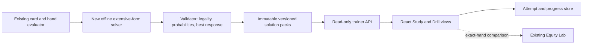

# PokerLab GTO Trainer — implementation plan

**Status:** implementation underway, 24 September 2026. Product direction confirmed: **6-max cash preflop first**, then turn, river, partial-hand and full-hand practice, with more game formats later. PokerLab will generate its own strategy data. Planning assumption: 100bb effective stacks and chip EV. Start solver validation without rake; realistic cash packs will specify rake, blinds and allowed bet sizes before solving.

The immediate, user-confirmed scope is the [focused solver demo](GTO_Demo_Scope_Review.md): one explainable preflop all-in spot with two active players at a six-seat table and a playable ten-decision trainer. The broader milestones below are a roadmap, not work required to finish that demo.

That demo is now implemented for local use with the wider exact validation pack. Its two-player API binds questions to the full saved pack, serves ten reproducible decisions and recomputes every EV and review total. The website shows the table history, assumptions, answer frequencies and a complete session review. [Local setup](local-development.md#research-trainer-api) and the [content review](preflop-demo-content-review.md) explain why the exercise remains `VALIDATION_ONLY`.

The next backend scaling check is documented in the [exact-payoff cost study](preflop-payoff-scaling.md). Suit-equivalence reuse preserves exact payoff values and can reduce duplicate board enumeration in suit-expanded ranges, but it saves no work on the current 47-matchup demo pack. Broader content therefore still needs credible input ranges and a measured payoff-computation budget before another lesson is published.

The [bounded river research model](river-solver-research.md) now covers a fixed board, one bet size, both players' check/bet and call/fold decisions, an exact-game best-response check, a versioned validation pack, an opt-in question/grade API and a local research drill. The [turn-to-river research model](turn-river-solver-research.md) adds a real public-card chance node and exact seven-card showdown, with a measured best-response gap, versioned validation pack, opt-in turn/river drill and connected partial-hand replay on a small two-street fixture. The [flop-to-river research model](flop-turn-river-solver-research.md) adds a third connected street and measures the cost and error of restricted versus exact turn chance. Its restricted fixture has a large check-down equity bias; a full-deck validation pack now powers an opt-in connected flop-hand drill. These are separate synthetic games. Their ranges have not been derived from a preceding street, so they cannot yet supply continuation values for broad preflop calls or appear as reviewed mixed-street lessons.

## Current implementation

The [multiway solver research path](multiway-solver-research.md) now handles up to six players in a forced-shove, sequential call/fold subgame. It includes blocker-aware joint deals, exact board enumeration reused across active subsets, per-seat chip accounting, multi-player regret matching and unilateral deviation measurement. Immutable equal-stack and unequal-stack packs feed the separate opt-in API and local website drill with replayable ten-question sessions, mixed/fixed responding seats, conditional EV grading and complete session review. The unequal-stack variant settles main and side pots with exact-board payoffs, a measured deviation score and its own strictly validated, versioned pack. A larger exact side-pot fixture now covers 64 joint deals and two private combos per seat, yielding varied practice hands in the local research drill. The synthetic ranges and restricted game still make this a **validation-only model**, not a publishable six-player chart. No general open/raise tree, rake or postflop continuation from this game is implemented yet.

A [bounded six-seat preflop betting engine](preflop-betting-tree-research.md) now checks the action order, blind and bet commitments, minimum raises, fold wins and all-in endpoints for a configured raise-size menu. The existing two-player all-in spot replays through it before a pack is accepted. A non-all-in call ends at an explicit postflop-continuation boundary with no assigned EV, so this rules work does not create a new strategy chart or change the validation-only status of existing lessons.

A [heads-up preflop-to-flop research handoff](preflop-flop-transition-research.md) now carries a completed two-player pot into the three-street game with correct postflop action order, pot, remaining stack and blocker-aware flop chance. It requires explicit per-combo likelihoods for the observed preflop actions; these are not yet supplied by a solved six-seat policy. This connects the models mechanically without treating independently invented postflop ranges as preflop continuation values.

A [connected BTN-versus-BB research game](connected-preflop-continuation-research.md) now learns a small preflop open/call strategy and flop/turn/river continuation in one CFR tree, with a measured best-response gap. Its fixed four-seat folds, synthetic ranges and restricted flop/turn deck mean it is still a solver correctness fixture, not a publishable 6-max preflop chart.

An [exact full-deck chance audit](connected-chance-abstraction-audit.md) now quantifies the separate abstraction error for forced check-downs. The initial connected fixture has over 1bb of weighted bias, and a seeded menu calibrated to its four combos fails badly on unseen combos. Broader preflop content must therefore pass independent range/board validation; a small gap against the abstract game alone is insufficient.

A [seeded chance-sampling study](chance-sampled-cfr-research.md) now compares vanilla CFR that samples every chance layer, a variant that enumerates private matchups before sampling public cards, and exhaustive CFR+ on the same connected game. Enumerating private matchups improves the sampled strategy gap substantially, but exhaustive CFR+ remains faster to a useful gap on this small fixture. This work provides reproducible scaling and audit infrastructure; sampled policies remain research-only and do not address the public-card bias above.

The [physical-deck connected path](physical-deck-connected-research.md) removes that handpicked-card bias by sampling all legal public runouts. A separate [board-bucket experiment](connected-board-bucket-research.md) shares coarse public observations and audits held-out self-play plus one-decision preflop deviations. At 5,000 iterations it visits about fourteen times fewer information sets and fixes a large pocket-aces opening error in the exact-observation profile, but it still has measurable deviations and no full-game quality bound. Neither connected profile is admitted to the trainer.

A [disjoint-range validation](connected-range-validation.md) adds nine new private matchups and sample-split audits of BB's first flop, turn and river decisions under learned earlier-street reach. Pocket aces still open frequently across two seeds, while a medium pair has an estimated preflop deviation and some selected later-street actions lose value on held-out states. Fewer than 10% of sampled river decisions sit in buckets with ten held-out observations, making later-street validation a concrete blocker for the broader preflop trainer.

A [board-granularity study](connected-bucket-granularity-research.md) compares the current and a much coarser observation on identical physical trajectories. The coarse mode raises the fraction of reached river decisions with 20 observations from roughly 1% to 54–58% across two seeds, but merges strategically distinct boards and has not passed a quality gate. It remains an offline research mode, not trainer content.

An exact-showdown [river alias audit](connected-bucket-granularity-research.md#river-information-loss-counterfactual) finds opposite fixed-response bet/check incentives inside both modes' information sets. The coarse grouping adds roughly 0.14bb of empirical observation loss in that controlled, always-called river bet test. This is a concrete reason to seek an observation with both sufficient sample support and better retention of strategic information before broadening the trainer.

The [observation-frontier follow-up](connected-abstraction-frontier.md) adds an intermediate texture mode, a 25-deal synthetic stress range, and sample-split river decisions. It measures the coverage/information tradeoff across all three modes on identical boards and shows that a coarser mode can win a low-data held-out *fixed-response* test despite worse perfect-information loss. Connected CFR sanity runs on both ranges still leave river validation sparse. No new connected-game pack is published.

The [range-aware river follow-up](range-aware-connected-river-research.md) uses exact showdown against the declared, blocker-adjusted opponent prior to add a river observation band. It improved held-out fixed-response decisions in the initial two seeds of two synthetic ranges and can be trained in the connected physical-deck game, but its prior is not conditioned on actions and a medium-pair preflop deviation remains. A paired held-out audit finds the 5×5 advantage under 50% independent calls is only about 0.005bb in those two seeds; a 16-seed sweep includes five splits favouring coarse. The larger gains against a pair-or-better caller still depend on that chosen response model. It is another offline research mode, not a trainer solution pack.

An [explicit action-belief follow-up](range-aware-connected-river-research.md#explicit-preflop-action-belief-experiment) multiplies opponent combo priors by externally declared BTN-open or BB-call likelihoods before assigning a river equity band. The held-out BB river audit samples the same synthetic action model: across eight 5×5 seeds, the conditioned observation gains about 0.067–0.078bb over the static observation, while two 3×3 seeds show no resolved gain. This verifies the Bayes update and gives an in-model benefit, but the likelihoods are chosen rather than learned, postflop checks are forced, and connected CFR actions need not follow the declared likelihoods. A [mis-specification sweep](range-aware-connected-river-research.md#belief-mis-specification-and-hand-dependent-response) shows that a reversed belief loses roughly 0.18–0.20bb against an always-calling BTN on 5×5. On 3×3 with a pair-or-better caller, even the correct preflop belief lowers selected gain by about 0.02–0.03bb; the equity band does not encode the BTN's river response. Informative postflop actions, response-aware observations and independent strategic validation are the next backend gates; this mode is not a trainer pack.

The [postflop-action follow-up](range-aware-connected-river-research.md#flop-and-turn-action-conditioned-reach) now samples both players' flop and turn checks under an explicit public-board/hand-strength likelihood model, so checkdown itself changes the reached opponent range. A separate river mode updates each candidate opponent combo from its own observed actions without exposing the dealt hidden hand. Across eight 5×5 seeds with an always-calling BTN, correct-model postflop conditioning gains about 0.093–0.113bb over preflop-only; reversing the check signal loses about 0.18–0.21bb. With a pair-or-better river caller, the correct-model gain is smaller and some intervals include zero. On the 3×3 pair-caller case, the static observation still beats both conditioned modes in the inspected seed. These are fixed synthetic likelihoods and responses, not a credible 6-max policy. The next gate is a response-aware observation plus independent strategic validation before any trainer promotion.

The [response-value follow-up](range-aware-connected-river-research.md#river-response-value-observation) tests a river bucket based on expected bet-minus-check value under an assumed BTN response. On 5×5, matched fixed-response models improve held-out selected gain by roughly 0.019–0.081bb over the postflop-equity bucket across four seeds. Assuming pair-or-better calls when BTN actually always calls loses roughly 0.175–0.269bb, a larger error than the matched gains. This remains an offline audit: the immediate solver priority is an independently justified strategic BTN response and connected-game validation, before using any response-aware policy for trainer questions.

The [one-step strategic caller follow-up](range-aware-connected-river-research.md#one-step-strategic-river-caller-and-support-backoff) makes BTN call/fold optimal against a declared BB river betting likelihood after public blockers and earlier observed actions. It gives the policy only public history, not a dealt BB hand. A finer response-value bucket alone *loses* about 0.017–0.036bb against this caller on four 5×5 seeds because support falls; falling back to the existing postflop bucket on unsupported states gains about 0.065–0.069bb instead. A wrong response model can still lose. The next solver milestone is to derive the river response from a connected solved policy and test independent physical-hand performance; no new trainer pack is warranted by this audit.

The [connected-policy response audit](range-aware-connected-river-research.md#connected-policy-river-response-transfer) now uses mixed BTN river call probabilities from independently trained connected CFR solutions, reports missing information sets and keeps support backoff. On synthetic, held-out 5×5 checkdown reach, an alternate-solution response gains only +0.010–0.039bb over the postflop bucket across four seeds, versus +0.147bb when seed 42 reuses the same solution as truth. This is an off-policy transfer, not a connected-game quality certificate. The next gate is to evaluate independent physical runouts reached by the learned preflop and postflop strategies themselves, with missing-policy mass and one-decision deviations made explicit.

The [on-policy connected river audit](range-aware-connected-river-research.md#on-policy-connected-river-response-and-one-decision-audit) now measures that gate on physical hands reached by the primary solution. It requires learned action strategies at each sampled decision, exactly evaluates the short river tree, and scores BB check/bet choices selected on separate discovery hands against held-out hands. With 3,000 iterations per solve, independent BTN call frequencies differ by about 0.079–0.093 on average across two seeds each of the 3×3 and 5×5 synthetic ranges. The alternate-informed minus primary-informed held-out BB gain ranges from −0.102 to +0.024bb, changing sign across seeds; river keys are also still occasionally missing. This is useful evidence about transfer instability, not a convergence certificate or trainer policy. Next prioritize independent-solve stability across training budgets and a connected-game deviation bound before promoting any response-aware observation.

The [training-budget sweep](range-aware-connected-river-research.md#independent-solve-training-budget-sweep) now runs 300, 1,000 and 3,000 iterations per independent solve on two seeds of each synthetic range. BTN response disagreement falls in all four seed/range pairs, but held-out BB action transfer remains inconsistent and sometimes worsens as the budget grows. This narrows the next backend task to broader seed coverage and **connected-game** deviation or best-response measurement; adding more training iterations alone is not an admission rule for a 6-max trainer pack.

A [strict connected street-deviation audit](connected-range-validation.md#strict-connected-policy-street-deviations) now rejects missing learned actions and scores BB check/bet choices on held-out physical hands at flop, turn and river. At 3,000 iterations, the 3×3 turn choice gains about 0.08–0.09bb over the learned mix in two seeds; at 10,000 iterations that resolved gain disappears. Wider-range and river results vary, and some discovery-selected actions lose value on held-out hands. This is encouraging as a diagnostic, but it is still one BB decision with fixed continuations, not a full-game quality bound. The next solver milestone needs a bounded full-game best-response or deviation test for both players before connected policies enter trainer packs.

An [exact finite-chance best-response bridge](connected-range-validation.md#exact-best-responses-on-sampled-physical-chance-subgames) now tests both players on small subgames cut from the physical deck, with explicit uniform completion and fallback-path accounting. The physical-game policy has large gaps on those aggressively restricted chance menus, while CFR+ trained on each same subgame reaches gaps around 0.001bb. The menu changes the game and can change what public boards reveal about private hands; these numbers are **not** full-deck exploitability. The next gate must quantify chance approximation error on broader held-out runouts or develop a full-deck sampled best-response estimator before the connected policy is eligible for trainer packs.

The [full-deck response search](full-deck-response-search.md) now trains a separate approximate response for BTN and BB against a fixed connected policy, then compares each with baseline on independent legal physical runouts. At a 50,000-iteration response budget, both 3×3 seeds show clear held-out BTN gains even against 10,000-iteration baselines (+0.089 and +0.096bb); 5×5 high-budget results are smaller and less consistently resolved. This is a meaningful **lower-bound deviation diagnostic** with explicit fallback and paired sampling error, not a certified best response or an exploitability upper bound. It keeps the connected physical policy out of trainer packs and focuses the next validation on response-search stability and a defensible full-game quality bound.

A [seed-and-budget stability audit](full-deck-response-search.md#seed-and-budget-stability-with-an-independent-confirmation-split) now trains four candidate responses per player, selects one on common validation hands, and scores it on a separate confirmation stream. Across two baseline seeds of each synthetic range, none of the eight selected player/profile confirmations resolves a positive deviation at 20,000 physical deals; some short-budget candidates lose value. This exposes response-training variance and validation-selection optimism rather than clearing the policy. A stronger full-game quality bound and realistic 6-max game model remain prerequisites for general trainer content.

An [exact finite-chance calibration and two-policy full-deck follow-up](full-deck-response-search.md#exact-game-calibration-of-response-optimization) identified why average-only search was weak: even with complete coverage in a small exactly enumerable physical subgame, averaged responses remained 0.001–0.056bb short of the exact response, while final-regret policies were consistently closer in the tested menu. The physical-deck audit now validates both variants before independent confirmation. Three of eight selected player/profile results have nominal positive intervals, including a +0.216bb BB deviation on 3×3 seed 42; other seeds remain unresolved. This strengthens the evidence of exploitable value in the synthetic connected policy and the need for better response-search bounds, without admitting a trainer pack.

An [exact-root chance variant](full-deck-response-search.md#enumerating-private-deals-while-sampling-public-cards) now enumerates all weighted private deals per response iteration while still sampling later legal public cards. At comparable initial-deal traversal budgets, it narrows exact-subgame response shortfall in some 5×5 cases and yields four nominally positive selected full-deck confirmations across eight player/profile runs. Results across seeds and the 3×3 comparison remain mixed, so it stays optional and does not alter the trainer-content gate.

A [three-menu, two-response-seed calibration](full-deck-response-search.md#response-optimizer-across-independent-chance-menus) now compares both sampling modes against exact best responses at roughly 50,000 private-deal traversals per search. Exact-root lowers mean and worst BB optimizer shortfall on both synthetic profiles, but it is neutral or slightly worse for BTN. The mode remains opt-in while more menus, seeds, and actual runtime are assessed; no restricted-menu result certifies full-deck equilibrium quality.

An [optional stratified full-deck evaluator](full-deck-response-search.md#stratified-held-out-full-deck-evaluation) visits every weighted private deal per independent held-out batch and computes uncertainty across batches. An exact-weight unit control passes. Eight-seed, equal-trajectory comparisons show less observed evaluation spread on the 5×5 fixture but more on 3×3, so sampled evaluation remains the default. This improves measurement infrastructure without supplying the missing full-deck best-response upper bound or changing trainer-pack eligibility.

The API now has an **opt-in, validation-only research drill** for the screened exact pack. It loads a pack from an explicit filesystem path at startup, rejects sampled or numerically unscreened packs, and serves deterministic questions and seed-based grading at `/api/v1/trainer/research`. The route is absent by default. It is an engineering path for testing the contract, not a public lesson or a realistic 6-max strategy; the synthetic ranges still need editorial review. [Local setup and request examples](local-development.md#research-trainer-api) document the boundary.

The independent `solver` Maven module now has alternating full-tree **vanilla CFR and CFR+ style regret matching**, a Kuhn poker benchmark, exact strategy-profile evaluation, and a conditional two-player preflop shove/fold then call/fold game. The CFR+ variant clips cumulative regrets after each player's full pass and uses linearly weighted strategy averaging with no delay; it is a scalar correctness implementation, not a vectorized large-game solver ([algorithm reference](https://arxiv.org/html/1407.5042v1)). The preflop model removes blocked card combinations, normalizes weighted range matchups, and accounts for committed chips and dead money. Called all-in payoffs can use either reproducible Monte Carlo estimates or exhaustive board enumeration. A [versioned, validation-only pack](../solver/src/test/resources/validation-pack.json) binds the six-seat spot hash, exact matchup payoffs, combo strategies, action EVs and a best-response gap; the loader checks these values again. The committed synthetic fixture has a 0.011635bb gap after 3,000 vanilla CFR iterations and zero payoff sampling error. On the same exact payoff table and iteration budget, CFR+ reaches about 0.0000078bb; this is a small-fixture result, not a broader speed claim. A backend `PreflopTrainer` draws reproducible, blocker-adjusted hero hands, returns a question without private opponent cards or action EVs, and grades a choice by exact-combo EV loss. The fixture's three hero combos all shove at approximately 99.98% frequency, so the playable demo uses the wider exact pack instead. Both packs remain validation-only; neither is a general 100bb opening chart.

## Provisional pack screening

The second, still synthetic `DiverseValidationSpot` keeps the same six-seat action history but expands to eight hero and seven opponent exact combos. Of 56 possible pairs, 47 are unblocked. A 10,000-trial seeded version produces clear folds, shoves and one apparent mixed combo, but its largest called-payoff sampling standard error is about **1.004bb**, larger than the mixed combo's EV difference. An [exact-enumeration fixture](../solver/src/test/resources/diverse-validation-pack.json) confirms the decision variety without sampling error. With 3,000 CFR+ iterations, its best-response gap is about **0.000149bb against the exact payoff table**.

`PreflopPackScreening` now reports provisional automated findings: a gap above 0.05bb, called-payoff standard error above 0.1bb, fewer than six exact combos in either range, or no clearly preferred shove/fold. A clear action requires an EV edge greater than both 1bb and three times the maximum called-payoff standard error. These are engineering screening cutoffs, not a statistical guarantee or a publication decision. The narrow exact pack fails range breadth and decision diversity; the sampled wider pack fails payoff precision; the exact wider pack passes these numeric checks. All remain `VALIDATION_ONLY`. Before publication, review range plausibility, legal action coverage and rake/stack assumptions separately. The current eight-combo range is synthetic and cannot be labelled a representative 6-max strategy.

A [range-sensitivity probe](preflop-range-sensitivity.md) now re-solves the exact wider pack after 30 one-at-a-time ±25% range-weight changes. Aces remain a clear shove and 76 suited a clear fold, but KQ suited's preferred action reverses and the AK suited mix moves substantially. This is why passing the numeric screen still cannot promote the pack. The next reviewed ranges need provenance and plausible uncertainty bounds, followed by the same probe.

## Product boundary

PokerLab currently estimates **showdown equity for exact hole cards** by sampling unknown boards. That is useful for studying a matchup, but it cannot tell a player whether to check, bet, call, raise, or fold. A GTO trainer needs a specified game (ranges, board, pot, stacks, action order, legal bet sizes and payoff rules) plus an approximately equilibrium **strategy at each decision**. The existing equity simulator should remain available as an **Equity Lab**, linked from training feedback for context, without being used to grade decisions.

For the first release, “GTO” will mean an approximate strategy **within a displayed, bounded game and betting tree**. It will not mean an exact solution to unrestricted 6-max no-limit Hold'em. Every exercise must show its assumptions and solution quality. A no-rake, two-player zero-sum subgame can be checked with a best-response/Nash-gap measure; the corresponding CFR convergence claim does not automatically extend to raked or multiway play. [CFR](https://papers.nips.cc/paper_files/paper/2007/hash/08d98638c6fcd194a4b1e6992063e944-Abstract.html) and [CFR+](https://arxiv.org/abs/1407.5042) are established approaches to approximating equilibrium in imperfect-information poker games; solution builders require ranges, pot/stack settings and a betting tree as inputs ([GTO Wizard documentation](https://help.gtowizard.com/how-to-build-custom-solutions/)).

## First target: 6-max cash preflop

The product target is 6-max cash preflop: unopened raises by position, blind defence, facing opens, 3-bets and 4-bets at a documented stack depth and rake structure. Start with a 100bb reference configuration unless the game definition changes during the first milestone. The eventual chart must respect all six seats, folded players, card removal, legal actions and downstream play. A 13×13 grid should show strategy by hand class, while grading uses the exact two-card combo and its blockers.

The **solver proof** can start with Kuhn/Leduc poker and a bounded, no-rake preflop all-in subgame. In a 6-max cash context, a late preflop shove/call spot that is all-in if called avoids unresolved postflop branches and gives a real, clearly labelled first training exercise. This is a correctness milestone, not a substitute for ordinary 100bb open/call/3-bet charts. The first broader user-facing curriculum should then expand through heads-up pots from a six-seat table (for example, button versus big blind after the other seats fold) before tackling branches where several players remain in the hand. Cash packs with rake need their own payoff and quality validation.

For deep-stack opens and calls, the solver must model **postflop continuation**. Showdown equity alone cannot value a preflop call or small raise that reaches later decisions. River, turn and flop models therefore become prerequisites for broad 100bb preflop charts, even though the **trainer's first priority and first navigational section remain preflop**. The [connected physical-deck research path](physical-deck-connected-research.md) now samples all legal public cards without a handpicked menu, but its strategy remains sparse and uncertified. This makes the work a staged solver project measured in months rather than a quick frontend feature. Importing another trainer's proprietary solutions is outside this plan.

## Player experience

1. Choose a 6-max cash preflop lesson by position and action history, or start a short random drill. Examples grow from an all-in response spot to opening, blind defence and 3-bet decisions as their solution packs pass validation. Later, a **Mixed Practice** mode samples from validated preflop, turn, river, partial-hand and full-hand packs, with user-adjustable weights and filters. It should never offer a mode for which no solved packs exist.
2. See the game format, position, hero cards, blinds, pot, effective stack, previous actions and only the actions legal at this node. For later streets, show the board. The opponent's private cards remain hidden.
3. Pick an action. Reveal the solution's action frequencies for this exact combo, action EVs in big blinds, and the EV difference from the best available action. A mixed strategy is shown as a mix; a lower-frequency action is not automatically branded a mistake when its EV is effectively tied.
4. Show a concise reason tied to the actual spot (blockers, range interaction, pot odds) and let the user inspect both players' ranges and the relevant action tree. Explanatory text is editorial content reviewed against the solved data, not generated as if it were solver output.
5. Save the attempt, move to the next spot, and offer a review queue for decisions with high EV loss. Keep session totals and per-topic progress separate from the existing simulation history. The 13×13 grid can switch between strategy view and “hands I miss” view.

An optional “open in Equity Lab” action can populate the current simulator with **specific compatible hands** for comparison, but must explain that one exact-hand showdown equity is different from range-versus-range strategy EV. The trainer itself should not display a single “correct” button for mixed nodes. Established trainers expose strategy frequencies and session/EV-loss feedback, which are useful reference patterns rather than data sources ([training flow](https://help.gtowizard.com/how-to-use-the-trainer/), [performance metrics](https://help.gtowizard.com/measure-performance/)).

## Architecture and data contracts

```mermaid
flowchart LR
  E[Existing card and hand evaluator] --> S[New offline extensive-form solver]
  S --> V[Validator: legality, probabilities, best response]
  V --> P[Immutable versioned solution packs]
  P --> A[Read-only trainer API]
  A --> UI[React Study and Drill views]
  UI --> T[Attempt and progress store]
  UI -. exact-hand comparison .-> EQ[Existing Equity Lab]
```

- Add a `solver` Maven module, independent of Spring, with information sets, weighted two-card ranges, blocker-aware combo enumeration, legal action trees, terminal chip payoffs and CFR/CFR+ strategy generation. Reuse `engine` card parsing and `HandEvaluator`; do not repurpose the Monte Carlo batch result as strategy data. Prove the generic tree on Kuhn poker before connecting Hold'em.
- Define a versioned `SpotDefinition`: table size, active seats, street, board where present, positions, blinds/antes, pot and effective stacks in big blinds, starting range weights, action history, permitted actions/sizes, rake model, and a stable content hash. The initial validation pack is a 6-max cash *context* with a two-player preflop all-in decision, chip EV and explicitly **no rake**. Later cash packs must carry their actual rake rule; calls and multiway branches enter only when their continuation model is validated.
- For the first all-in branch, compute matchup payoffs with card removal. Benchmark exact enumeration on small validation sets and use a reproducible, measured method for larger payoff tables; track both solver convergence error and any payoff-estimation error in the pack. For non-all-in preflop actions, use a validated postflop continuation strategy, not terminal showdown equity. Never present a solution-quality number that ignores sampling or continuation-model uncertainty.
- Define a `SolutionPack`: spot hash, solver/build version, generation date, convergence metric and unit, legal actions, combo-level action probabilities, combo/action EVs, and range summaries. Reject packs with unknown versions, illegal combos, missing actions or probabilities that do not sum to one within a documented tolerance.
- Generate packs **offline**. Serve reviewed packs through read-only endpoints such as `GET /api/v1/trainer/spots`, `GET /api/v1/trainer/spots/{id}` and `GET /api/v1/trainer/spots/{id}/strategy?combo=...`. Store small immutable compressed packs as application artifacts first; add object storage only when pack size and deployment needs justify it.
- Save `Attempt` data (`spotId`, solution version, node, hero combo, selected action, best/action EV, EV loss, time) separately from Monte Carlo `Simulation` data. Anonymous local progress is enough for the first vertical slice; per-user PostgreSQL progress requires authentication and privacy design later.
- Keep the existing `/api/v1/simulations` and worker path intact. Preflop payoff generation and later turn/flop solving may become compute-heavy; add a **separate solve-job type and resource budget** before reusing the queue/outbox infrastructure. A page request must never launch an unconstrained solve.
- Define a `TrainingMode` registry (`PREFLOP`, `TURN`, `RIVER`, `PARTIAL_HAND`, `FULL_HAND`) whose entries point to compatible solution packs. A partial hand starts from a saved public/action state. Full-hand play requires a **coherent strategy across connected decision nodes**; independently solved spot packs cannot simply be stitched together and called a full-hand solution. The mixed-mode picker samples only published, compatible packs and records its selection seed for repeatable sessions.

## Delivery sequence and exit criteria

| Milestone | Work | Done when |
| --- | --- | --- |
| **0. Freeze the cash-game model** | Write the first 6-max 100bb ruleset: blinds, the no-rake validation baseline and future rake/cap variants, allowed open/3-bet/4-bet sizes, fold order, chip-EV accounting and a bounded initial decision. Record an ADR explaining solution labels and limits. | A reviewer can reconstruct every chip flow and legal action; the UI shows the exact ruleset for each drill. |
| **1. Prove the solver** | Implement vanilla CFR on Kuhn poker as a correctness harness, then a scalar CFR+ variant for a two-player, all-in preflop subgame from a six-seat cash table. Reuse the evaluator for runout payoffs and blockers. Extend benchmarks to broader ranges before declaring this milestone complete. | Known small-game equilibria, fold/call/jam payoffs, pot conservation, action legality and deterministic export pass automated tests. |
| **2. Validate and publish the first preflop pack** | Compute a two-player best-response/Nash-gap measure; benchmark payoff-table precision; add convergence curves and a pack validator. Publish the bounded all-in spot with conspicuous action/stack assumptions. | A drill can be graded from PokerLab-generated data, and every published pack reports model, solver and payoff uncertainty. The pack cannot be mistaken for a general RFI chart. |
| **3. Ship preflop Study and Drill** | Add a 13×13 chart, combo detail, table/position view, legal decision controls, mixed-frequency feedback, action EV/EV loss, session summary and Equity Lab link. | A user can complete a ten-decision preflop session on desktop and mobile, inspect each decision, and cannot submit an illegal action. |
| **4. Build postflop continuation** | Solve bounded heads-up river trees, then turn and flop chance nodes; benchmark action/card abstraction, rake handling and payoff error. Add these as turn/river and partial-hand drills. | Postflop packs pass their own validation; non-all-in preflop branches have a measured continuation model rather than raw showdown equity. |
| **5. Broaden 6-max preflop** | Expand from conditional heads-up pots to unopened opens by position, blind defence, facing opens and 3-/4-bet branches. Add realistic rake/cap and multiway continuations only with separate solver and payoff validation; do not apply a no-rake two-player convergence claim to these games. | A curated set of common 100bb preflop decisions is available with its game/rake/bet-tree assumptions and measured quality; unsupported spots are absent. |
| **6. Learning loop and mixed modes** | Add topic filters, spaced review, progress, accessibility/keyboard polish, then a weighted random mixer for preflop, turn, river and partial hands. Connect coherent policy trees for full-hand play only when available. | Progress survives refresh; mixed sessions draw only from validated packs; a full-hand path never jumps between incompatible solutions. |

The first end-to-end vertical slice is **one documented 6-max cash preflop all-in subgame, one hero decision, one validated solution pack, and one feedback screen**. Build that before a large library, dashboards or deployment work. A working proof and first narrow drill may take **4–8 focused weeks**; a credible breadth of 100bb 6-max opening/defence strategy with an original multi-street solver is a **multi-month research and engineering phase**, not a promise attached to the first UI milestone. Re-estimate after the solver and payoff benchmarks.

Once the 6-max cash curriculum is credible, extend the same versioned game/pack contract to other stack depths, rake structures and table formats. Tournament chip-EV and ICM are separate payoff models; a cash-game strategy pack must never be reused under a tournament label. Add each format to the random trainer only after its own solver and content checks pass.

## Correctness and product checks

- **Solver:** Kuhn benchmark; all-in payoffs checked against the existing evaluator and selected exact board enumerations; impossible-card and range-weight validation; legal actions at every node; zero-sum/payoff conservation; deterministic solution export for fixed inputs; strategy probabilities sum to one; best-response gap trends down with training iterations.
- **Feedback:** action EV is measured at the displayed information set against the saved solution continuation, not estimated from one dealt outcome. EV loss is reported in big blinds with the solution version; near-equal mixed actions are treated as near-equal EV. Recompute scores from immutable solution data rather than trusting browser-submitted EV values.
- **UI/API:** same spot/version is used for the question and answer; no opponent private cards before reveal; responsive layout; keyboard controls; empty/error states; no stale feedback after switching spots; existing equity simulation still works.
- **Operations:** generation time, memory, pack size and solver convergence are benchmarked locally. Early no-rake two-player solutions get a measured best-response gap; raked and multiway solutions need separately defined validation and conservative labelling. Public AWS deployment remains paused; review expected compute/storage costs and access controls before any new cloud resources are proposed.

## Assumptions to confirm during milestone 0

1. Use **100bb 6-max cash, chip EV** as the reference format. The first solver benchmark uses no rake; define a realistic rake/cap model, open/raise sizes and whether limps are in scope before publishing broader cash solutions. Different stakes or rake rules require different packs.
2. Keep saved progress anonymous in this browser for the first vertical slice. Decide whether accounts and cross-device history belong in the next product phase after the training loop works locally.
