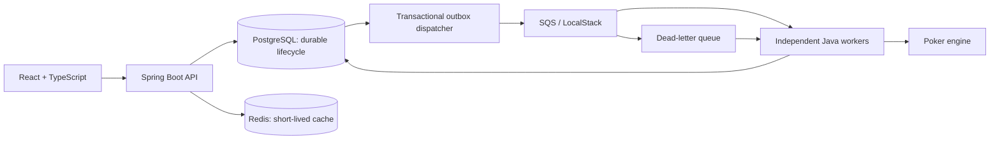

# Architecture

PokerLab Cloud separates numerical computation from delivery, persistence and presentation. The framework-free engine supports exact hole cards for 2–9 players, 0–5 known community cards and deterministic Monte Carlo batches. API and worker are independent Spring Boot processes; increasing worker replicas increases concurrent consumption.



## Responsibilities

| Component                  | Responsibility                                                                                                               |
| -------------------------- | ---------------------------------------------------------------------------------------------------------------------------- |
| `engine`                   | Immutable cards/player scenarios, validation, hand ranking, seeded board sampling, batch planning/results, benchmark harness |
| `shared`                   | Validated message codec, relational repositories, Flyway, queue adapters, outbox and transactional aggregation               |
| `api`                      | REST DTOs/validation, status/history/results, cache, OpenAPI, HTTP correlation IDs, publication scheduler                    |
| `worker`                   | Consume, renew visibility, compute outside transactions, submit results, acknowledge after commit, handle dead letters       |
| `frontend`                 | Accessible text-card form, progress polling, per-player results, recent history                                              |
| `infrastructure/terraform` | Restricted AWS demonstration environment; no automatic provisioning                                                          |

The original five-card evaluator is reused. Its seven-card path checks all 21 five-card combinations, comparing packed numeric scores without constructing verbose hand objects. No new external evaluator dependency was introduced.

## Submission and completion

```mermaid
sequenceDiagram
  participant UI as Browser
  participant API as API
  participant DB as PostgreSQL
  participant Q as SQS
  participant W as Worker
  UI->>API: POST scenario, iterations, optional seed
  API->>DB: Transaction: simulation + batches + outbox
  DB-->>API: Commit
  API-->>UI: 202 + simulationId + statusUrl
  loop Pending outbox rows
    API->>DB: Lock rows, SKIP LOCKED
    API->>Q: Publish independent batch
    API->>DB: Mark published, commit
  end
  Q-->>W: At-least-once delivery
  W->>DB: Lock simulation, validate, record attempt
  W->>W: Execute seeded batch outside transaction
  W->>Q: Renew visibility while computing
  W->>DB: Lock simulation; insert unique result
  alt First accepted delivery
    W->>DB: Increment progress; finalise if last batch
  else Duplicate or terminal simulation
    DB-->>W: No state mutation
  end
  DB-->>W: Commit
  W->>Q: Acknowledge
  loop Every 2 seconds until terminal
    UI->>API: GET status
    API-->>UI: Progress snapshot
  end
  UI->>API: GET results
  API-->>UI: Per-player counts and equity
```

## Persistence and correctness

`simulations` stores typed lifecycle fields and immutable JSONB configuration. `simulation_batches` stores batch identity, derived seed, trials, status and attempts. `batch_results` has a composite primary key and foreign key to its batch. `simulation_results` has one row per simulation. The `batch_outbox` insertion belongs to the submission transaction, closing the database/queue crash window.

Result processing locks the simulation row first. It validates the message configuration and result identity against durable metadata. An `ON CONFLICT DO NOTHING` insert distinguishes duplicates. Only new inserts increment counters. The last result finalises in that same transaction, summing batches in deterministic order and checking total trials. Workers may compute duplicate deliveries, but duplicates cannot alter equity, progress or completion twice. Different simulations can persist concurrently; completion writes within one simulation serialise deliberately.

Wins count outright pots; ties count participation in a split pot. Fractional equity shares preserve multiway splits. Aggregation sums shares and divides by total trials, handling unequal final batches correctly. See [engine contracts](engine.md) for limits, precision and reproducibility boundaries.

## Failure behaviour

| Failure                                               | Behaviour and recovery                                                                                                                                            |
| ----------------------------------------------------- | ----------------------------------------------------------------------------------------------------------------------------------------------------------------- |
| API crashes before submission commit                  | No partial simulation/outbox survives. POST has no client idempotency key, so an uncertain response after commit can lead to a second simulation on resubmission. |
| Queue unavailable                                     | Outbox remains pending; scheduled publication retries.                                                                                                            |
| Crash after queue send, before outbox commit          | Batch may publish again; result uniqueness absorbs duplicates.                                                                                                    |
| Worker crash, database failure or lost acknowledgment | Message becomes visible again after its unacknowledged lease expires.                                                                                             |
| Long-running batch                                    | Visibility renewed every 30 seconds for a 120-second lease; duplicate work remains safe if renewal fails.                                                         |
| Five unsuccessful deliveries                          | SQS redrives to DLQ; worker records terminal failure before acknowledging a valid failed batch.                                                                   |
| Malformed/unidentifiable message                      | Retained in DLQ for inspection, metered and alarmed; never used to fail an unrelated simulation.                                                                  |
| Late result/dead letter after completion              | Terminal state and accepted result remain unchanged.                                                                                                              |
| Concurrent final batches                              | Row lock plus unique final row permits one finalisation.                                                                                                          |
| Redis missing, flushed, corrupt or unavailable        | PostgreSQL reads still succeed. Status may be up to two seconds stale while cached.                                                                               |
| Browser/API connection interrupted                    | Shows error and explicit Retry; no overlapping polling requests or continued polling after terminal state.                                                        |

`CANCELLED` is modelled and rendered, but cancellation is not exposed as an endpoint. Authentication, ranges, S3 exports and autoscaling remain stretch goals. No code assumes exactly-once queue delivery.

## Security and deployment limits

Card/name/count validation applies before persistence, with a 100-million-trial request cap and at most 10,000 batches. Fractional integers are rejected. Browser seeds use decimal strings to avoid losing precision; Java preserves all signed 64-bit values. The API uses explicit detached DTOs. CORS is same-origin by default; Vite and nginx proxy local API requests. No cross-origin wildcard is enabled.

There is no user authentication or per-user quota. Local published ports bind to loopback; AWS ingress requires an explicit restricted CIDR. This is an interview/demo architecture, not a publicly open computation service. AWS secrets are supplied at task startup; database/cache are not publicly reachable. See [deployment guidance](aws-deployment.md) for cost, TLS, credentials and production adaptations.

Decisions: [SQS](decisions/ADR-001-queue.md), [PostgreSQL vs Redis](decisions/ADR-002-postgres-vs-redis.md), [idempotent workers](decisions/ADR-003-idempotent-workers.md).
