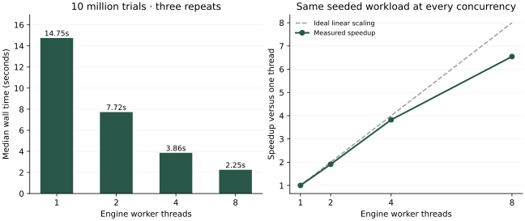

# Measured engine scaling

Measured on 22 September 2026, Windows 10 amd64, AMD Ryzen 7 5700X3D (8 physical cores / 16 logical processors), Microsoft OpenJDK 21.0.3, fixed 512 MiB JVM heap. Raw repetitions and runtime metadata are committed in [`data/`](data/). Values below are medians of three runs at each worker count.

The workload is **10,000,000 trials of AS AH vs KS KH vs QS QH**, with an empty board, seed `123456789` and 100 batches of 100,000 trials. A warmup of twenty batches precedes measurements. Every repetition checks trial conservation and compares every batch's player counts/equity shares to the first run, ensuring that worker count did not change the work or seeded output.

| Engine threads | Median seconds | Trials/second | Speedup | Efficiency |
| --- | ---: | ---: | ---: | ---: |
| 1 | 14.751 | 677,904 | 1.000× | 100.0% |
| 2 | 7.724 | 1,294,622 | 1.910× | 95.5% |
| 4 | 3.857 | 2,592,441 | 3.824× | 95.6% |
| 8 | 2.253 | 4,437,734 | 6.546× | 81.8% |



This is an **engine worker-thread benchmark**, including thread pool startup and result collection. It does not measure SQS, HTTP, PostgreSQL, Redis, container networking or cloud task scaling. Separate functional smoke tests exercise those boundaries; their timings are not presented as a distributed scaling benchmark. The build specification permits local thread scaling as the minimum demonstration.

## Reproduce

From the repository root with Java 21 and Maven:

```sh
mvn -pl engine package
java -Xms512m -Xmx512m -cp engine/target/classes com.pokerlab.benchmark.BenchmarkMain docs/data/benchmark.csv 10000000 3
python -m pip install matplotlib
python scripts/plot-benchmarks.py
```

The Java command writes all repetitions, median summaries and environment metadata. Speedup is one-thread median divided by measured wall time; efficiency is speedup divided by worker count. Run on an otherwise idle machine and report CPU/container limits alongside new measurements. The chart script only reads measured CSV values.

## Interpretation and limits

Independent batches scale well through four threads on this machine. Eight threads improve throughput further but reach 81.8% parallel efficiency. These measurements do not isolate the cause; scheduling, shared memory bandwidth/cache, garbage collection, thermal/frequency changes and background processes are plausible contributors. Hyperthreads are not additional physical cores. These were sequential groups of three runs, not a randomised experiment or a JMH microbenchmark.

The implementation preserves the existing direct hand-score evaluator, bypasses verbose hand objects in normal batches and excludes known cards before sampling. Board lists and winner lists still allocate inside the trial loop. We retained that readable implementation because measured throughput met the demo objective. Replacing these objects or changing the random generator would require another correctness and reproducibility review, followed by measurements under the same conditions.

Distributed throughput will additionally include publication, long polling, visibility renewal, database round trips, per-simulation row-lock contention and final aggregation. Cloud vCPU limits, network latency and JVM warmup can dominate small batches. Do not extrapolate this table into AWS cost or ECS speedup claims.
